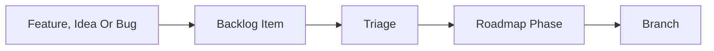
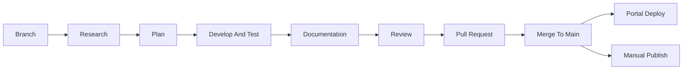
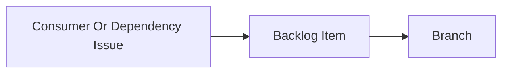

# AI Harness

The AI setup of this repository. It serves Claude Code only. Every artifact has exactly one home.

## Layout

| Artifact          | Path                                     |
| :---------------- | :--------------------------------------- |
| Instructions      | `CLAUDE.md`                              |
| Path-scoped Rules | `.claude/rules/*.md`                     |
| Agents            | `.claude/agents/*.md`                    |
| Skills            | `.claude/skills/*/SKILL.md`              |
| Permissions       | `.claude/settings.local.json`, untracked |
| MCP Approval      | `.claude/settings.json`                  |
| MCP Servers       | `.mcp.json`                              |

`CLAUDE.md` is intentionally minimal — behavioral directives only. Project knowledge stays in its documented home and is reached through [`README.md`](../README.md), which `CLAUDE.md` links. That link is the only always-on hop in the harness.

### Naming

`fd-` prefixes every skill and agent, so repository tooling is distinguishable from Claude Code's built-ins and from anything installed globally. A skill is named `fd-<verb>-<object>` after what invoking it produces. An agent is named `fd-<role>` after what it is, which keeps the two kinds apart in a name.

A skill's directory name and its frontmatter `name` are the same string. A skill whose two names disagree does not load.

---

## Rules

Rules are pointers, not content. Each one names the document to read and nothing else, so a convention exists in exactly one place, and a rule pulls in only the document its own area needs.

| File                            | Applies To                                                                         | Points At                                                                                                                             |
| :------------------------------ | :--------------------------------------------------------------------------------- | :------------------------------------------------------------------------------------------------------------------------------------ |
| `.claude/rules/angular.md`      | `projects/ngx-formidable/**` and `src/**`, `*.ts` and `*.html`                     | [`impl/components.md`](components.md), [`impl/typescript.md`](typescript.md), [`impl/ubiquitous-language.md`](ubiquitous-language.md) |
| `.claude/rules/dependencies.md` | Both `package.json`, `renovate.json`                                               | [`impl/renovate.md`](renovate.md)                                                                                                     |
| `.claude/rules/markdown.md`     | `**/*.md`                                                                          | [`impl/documentation.md`](documentation.md)                                                                                           |
| `.claude/rules/portal.md`       | `src/app/portal/**`                                                                | [`tech/portal.md`](../tech/portal.md)                                                                                                 |
| `.claude/rules/public-api.md`   | Library `components/`, `directives/`, `forms/`, `public-api.ts`, `vest/`           | [`user/components.md`](../user/components.md), `Library Obligations` of [`impl/definition-of-done.md`](definition-of-done.md)         |
| `.claude/rules/repository.md`   | Everything                                                                         | Invariants, stated inline                                                                                                             |
| `.claude/rules/styling.md`      | `**/*.scss`                                                                        | [`impl/styling.md`](styling.md)                                                                                                       |
| `.claude/rules/testing.md`      | `**/*.spec.ts`                                                                     | [`impl/testing.md`](testing.md)                                                                                                       |
| `.claude/rules/theme-tokens.md` | `_formidable-vars.scss`, `_tokens.scss`, `token-manifest.ts`, `theme-reference.md` | `Theme Tokens` of [`impl/definition-of-done.md`](definition-of-done.md)                                                               |

Scoping uses `paths` frontmatter. A rule without `paths` loads in every session, so `repository.md` stays short.

Conventions are split per area for the same reason. One file per rule means an SCSS edit does not load the component conventions, and a spec edit does not load the portal design.

---

## Using The Tooling

Only the manual tooling needs instruction. The automatic skills and the agents are selected from their `description`, so documenting when to trigger them would duplicate the frontmatter.

| Invoke          | When                           | Produces                             |
| :-------------- | :----------------------------- | :----------------------------------- |
| `/fd-drive-sdd` | Development begins on a branch | `.research/` then `.plan/` artifacts |
| `/fd-create-pr` | The Definition of Done is met  | One pull request                     |

Each of these has an outward-facing effect, so each is marked `disable-model-invocation` and runs only when invoked. An agent does not decide to open a pull request.

MCP servers are not invoked. Their tools are model-invoked, so there is nothing manual about them beyond the configuration below.

## Agents

| Agent          | Input                                                       | Effort  | Output                                     |
| :------------- | :---------------------------------------------------------- | :-----: | :----------------------------------------- |
| `fd-research`  | Requirement, repository, `implementation.md`, `backlog.md`  | Inherit | `.research/<slug>.md`                      |
| `fd-plan`      | `.research/<slug>.md`                                       | Inherit | `.plan/<slug>.md`                          |
| `fd-implement` | `.plan/<slug>.md`                                           | Inherit | Source code, progress appended to the plan |
| `fd-review`    | Diff, [`impl/definition-of-done.md`](definition-of-done.md) |  High   | Findings                                   |

An agent body stands alone and never assumes who invoked it.

`fd-research` and `fd-plan` declare a `tools` list that excludes `Edit` and `Write` on source code, because producing no code is the point of those phases. No agent declares a `model`, so each inherits the session model. `fd-review` declares `effort: high`, because catching a Definition of Done violation benefits from more reasoning. An agent's `effort` is part of its own definition, so the override applies on every invocation rather than only the current turn.

## Skills

| Skill                    | Invocation | Effort  | Purpose                                                      |
| :----------------------- | :--------: | :-----: | :----------------------------------------------------------- |
| `fd-create-component`    |    Auto    | Inherit | Place, wire and showcase a library or portal component       |
| `fd-create-handoff`      |    Auto    |   Low   | Compress a plan for a fresh context                          |
| `fd-grill-plan`          |    Auto    |  High   | Interrogate a plan for gaps                                  |
| `fd-research-issue`      |    Auto    | Inherit | Research a roadmap item and emit an external research prompt |
| `fd-review-change`       |    Auto    |  High   | Review a diff against the Definition of Done and run gates   |
| `fd-write-documentation` |    Auto    | Inherit | Apply the documentation guidelines                           |
| `fd-drive-sdd`           |   Manual   | Inherit | Own the SDD templates and drive the phases                   |
| `fd-create-pr`           |   Manual   |   Low   | Open a pull request from a template                          |

`effort` overrides the session's reasoning effort for the skill's own turn only, resuming the session value on the next prompt. `Low` marks mechanical, template-driven skills; `High` marks skills whose entire purpose is finding gaps or defects.

---

## Development Workflow

The harness supports Spec Driven Development. Each phase reads the previous phase's artifact from disk rather than from the conversation, so any phase can be resumed in a fresh session.

There is no issue tracker. [`impl/implementation.md`](implementation.md) is the source of truth for outstanding work — check it before starting. [`impl/backlog.md`](backlog.md) is the intake buffer for ideas that have not been triaged into a phase yet.

### Planning

Triage orders an item into a phase of the roadmap, with its dependencies stated, following the ordering strategy in [`impl/implementation.md`](implementation.md).

### Development

| Step             | Input                 | Output                         | Tooling                                             |
| :--------------- | :-------------------- | :----------------------------- | :-------------------------------------------------- |
| Branch           | Roadmap phase         | `feature/*` branch             | `git switch -c`                                     |
| Research         | Roadmap phase         | `.research/<slug>.md`          | `/fd-drive-sdd`, `fd-research`, `fd-research-issue` |
| Plan             | `.research/<slug>.md` | `.plan/<slug>.md`              | `fd-plan`, `fd-grill-plan`, `fd-create-handoff`     |
| Develop And Test | `.plan/<slug>.md`     | Source code, appended progress | `fd-implement`, `fd-create-component`               |
| Documentation    | Source code           | Documentation                  | `fd-write-documentation`                            |
| Review           | Diff                  | Findings                       | `fd-review`, `fd-review-change`                     |
| Pull Request     | Verified change       | Pull request                   | `/fd-create-pr`                                     |
| Release          | Merge to `main`       | Deployed portal, npm package   | `deploy.yml`, then `publish:lib` by hand            |

`.research/` and `.plan/` are untracked. Implementation progress is appended to the plan file rather than written to a third artifact, so a work item has exactly two files. Templates live in `.claude/skills/fd-drive-sdd/`. For a small task, skip SDD — edit directly and run `fd-review-change`.

### Maintenance

A defect reported by a consumer becomes a backlog item and then follows the development flow; bugs lead the roadmap. Dependency updates arrive as Renovate pull requests, see [`impl/renovate.md`](renovate.md). There is no separate hotfix path — `main` is the only release branch.

---

## Hooks

None. Verification is the explicit [`fd-review-change`](../../.claude/skills/fd-review-change/SKILL.md) skill.

Automatic format and lint hooks were deliberately rejected: they are noisy and loop-prone. A hook could force the mechanical checks but cannot judge whether a catalog entry or a document is meaningful, which is most of what the Definition of Done asks for.

## Formatting And Linting Discipline

- **No Unrelated Churn**: Do not reformat files unrelated to the task.
- **Existing Commands**: Prefer the existing formatter and linter commands over ad-hoc invocations.
- **Touched Files Only**: Prefer touched-file formatting. If a check fails, fix only the relevant files.
- **Before Done**: Run the format and lint checks before claiming done when code changed.
- **Never Edit Generated**: `dist/`, the `README.md` and `LICENSE` copies under `projects/ngx-formidable/`, and `assets/ladder.png` are never hand-edited.

## Permissions

The repository is public, so it imposes no permissions on a contributor's machine. The committed `.claude/settings.json` holds only `enabledMcpjsonServers`, which approves the servers in `.mcp.json`. Permissions are personal and live in `.claude/settings.local.json`, which is untracked.

The recommended baseline denies what must stay manual. `deny` outranks `allow`, so no allow rule re-enables these:

| Deny                                                        | Reason                                 |
| :---------------------------------------------------------- | :------------------------------------- |
| `git commit/push/merge/rebase/reset/revert/cherry-pick/tag` | History and remote changes stay manual |
| `git clean`, `git filter-branch`, `rm -rf`, `sudo`          | Irreversible                           |
| `gh pr merge`, `gh release`, `npm publish`                  | Outward facing                         |
| `npm run publish:lib`                                       | Outward facing — see below             |

- **Match On The Command String**: a `Bash` rule matches what is typed, not what runs. `npm run publish:lib` calls `npm publish` inside a script, so `npm publish` alone does not deny it.
- **Allow Rules Are Personal**: anything not allowed prompts. The allow list is a guardrail against routine mistakes, not a sandbox.
- **Pull Requests**: `fd-create-pr` never pushes, whatever the local rules say. It drafts and shows the request, then stops and asks for the push.

---

## MCP Servers

`.mcp.json` in the repository root is the single source.

| Server        | Transport | Purpose                                                       | Authenticates With |
| :------------ | :-------: | :------------------------------------------------------------ | :----------------- |
| `angular-cli` |  `stdio`  | Angular workspace introspection, documentation and migrations | Nothing            |
| `context7`    |  `stdio`  | Library documentation for a named dependency                  | API Key            |
| `playwright`  |  `stdio`  | Browser automation against the served portal                  | Nothing            |
| `ux-patterns` |  `http`   | UX pattern guidance and accessibility review for fields       | Nothing            |

`playwright` runs headless and isolated, so it never touches a real browser profile. It is a client and never starts or stops a server: reuse whatever is already listening on the portal's port, and ask rather than starting one. That contract is stated in `.claude/rules/repository.md`, because the risk applies to every task and not only to portal files. The portal routes on the hash, so a deep link is `http://localhost:4200/#/docs`, not `/docs`.

`angular-cli` runs the workspace's own Angular CLI through `npx ng`, so the server version always matches the installed CLI and its version-specific coding standards. It runs `--read-only`, which drops the tools that would otherwise start, stop or run a project target. That is the same Running Servers invariant `playwright` is held to, enforced by configuration rather than by instruction. The remaining tools cover project discovery, Angular best practices, documentation search, OnPush and zoneless migration planning, a tutor, and waiting on the build of a dev server that is already running.

Setup, the required environment variables and verification are in [`impl/developer-onboarding.md`](developer-onboarding.md).
