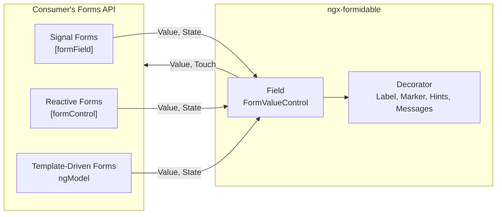

# Implementation Roadmap

The source of truth for outstanding work. [`impl/backlog.md`](backlog.md) is the raw intake buffer for new, untriaged ideas; this file is where they land once they are ordered into phases.

- **One Phase, One Conversation**: phases are sized to be finished in a single session. Do not merge them.
- **Delete On Ship**: when a phase ships, its entry here is **deleted**, not annotated. The commit history holds what shipped. See the Definition of Done in [`impl/definition-of-done.md`](definition-of-done.md).
- **No Silent Reordering**: a phase's dependencies are listed with it. Do not start a phase whose dependencies are open.

## Ordering Strategy

- **Bugs First**: defects lead, whichever section they came in under.
- **State Before Style**: a state hook ships before the styling that reads it — border geometry and `aria-invalid` both read the invalid-state hook.
- **Docs Last**: API documentation and the `README.md` pass come after the API stops moving.
- **Portal After The Library**: the portal must expose every field option and theme token, so it starts only once those are stable.

---

## Forms-Agnostic Rewrite

The fields work with Signal Forms, reactive forms and template-driven forms alike, validation belongs to whichever forms API the consumer chose, and the library renders, edits, decorates and themes. Phases 17 to 31 get there.

### Decisions

| Topic          | Decision                                                                                                                                                                                  |
| :------------- | :---------------------------------------------------------------------------------------------------------------------------------------------------------------------------------------- |
| Field Contract | Every field implements Angular's `FormValueControl<T>`. No field is a `ControlValueAccessor`                                                                                              |
| Validation     | None in the library: the template-driven harness and the Vest entry point go. Rules are Signal Forms rules, a Standard Schema such as Vest, Zod or Valibot, or the classic validators     |
| Messages       | The decorator renders its field's messages. `formidable-field-errors` is presentational, placed by hand for a group, the form or a custom spot                                            |
| Model          | The model is the only source of truth. A field writes only on user interaction and corrects nothing it is given                                                                           |
| Reveal         | `touched` (default), `dirty` or `always`. `submitted` goes: Signal Forms keeps no submitted state, and `submit()` touches every field anyway                                              |
| Value Types    | `string` for input and textarea, `boolean` for toggle, `number` for slider, `string[]` for checkbox-group, `string \| null` for the other option fields, `Date \| null` for date and time |
| Naming         | Angular's current style guide: `input-field.ts`, `InputField`, `FormidableField` — no `Component` or `Directive` suffix, no `I` prefix                                                    |
| Setup          | `provideNgxFormidable()` only. `NgxFormidableModule` goes                                                                                                                                 |
| Studio Export  | Signal Forms only                                                                                                                                                                         |
| Diagrams       | Mermaid, which the portal's `Docs` route renders as well                                                                                                                                  |
| Test Runner    | Karma stays. A Vitest spike is in [`impl/backlog.md`](backlog.md)                                                                                                                         |

### Target Architecture

| Concern                                                                  | Owner                                                                              |
| :----------------------------------------------------------------------- | :--------------------------------------------------------------------------------- |
| The model, the value flow, the rules, when they run, submission          | The forms API and the consumer's validator                                         |
| Touched, dirty, errors, pending, disabled, readonly, required            | The forms API, pushed into the field's `FormUiControl` inputs                      |
| Editing, keyboard, masking, panels, ARIA                                 | The field                                                                          |
| Label, required marker, hints, prefix, suffix, messages and their reveal | The decorator, reading its field                                                   |
| Message text                                                             | `FORMIDABLE_ERROR_MESSAGE`, an `(error) => string` defaulting to `message ?? kind` |

- **Field**: `BaseField<T>` — `value` is a `model()`; the `FormUiControl` inputs, each accepting `undefined` and falling back to the field's default; a `touch` output as the last act of a blur; `focus(options?)`; the library's own `placeholder`, `autoFocus` and `revealOn`; and `showErrors`, derived from the state and the reveal.
- **Decorator**: reads the projected field, and nothing of any forms API.
- **Consumer Convention**: one `*.form.ts` per form holds the model interface, an initial model defining every key — Signal Forms drops an `undefined` one — and the `schema()`. The component holds `form()` over a `signal` of the initial model; the template is `<form [formRoot]>` with decorated fields bound by `[formField]`. The Studio exports exactly this.

### Angular Behaviour Relied On

Read off the installed `@angular/forms` and the Angular documentation. The phase named proves each with a spec before any guide states it.

| Behaviour                                                                                                                                                                   | Proven In |
| :-------------------------------------------------------------------------------------------------------------------------------------------------------------------------- | :-------: |
| `[formField]` prefers a value accessor over a custom control, and the `NgControl` it provides has no `markAs*`, `events` or `valueChanges`                                  |    19     |
| `[formField]` writes the schema's state into same-named inputs: `name`, `readonly`, `disabled`, `required`, `min`, `max`, `minLength`, `maxLength`                          |    19     |
| `ngModel`, `[formControl]` and `formControlName` bind a custom control with no value accessor and forward `touched`, `dirty`, `invalid`, `pending`, `disabled` and `errors` |    19     |
| The classic APIs ignore `updateOn` for a custom control, forward `required` everywhere but under `ngModel`, and never forward `readonly` or `name`                          |  19, 20   |
| `ngModel`, `[formControl]` and `formControlName` attach no directive validator — `required`, `minlength` — to a custom control's control, as of 22.2                        |    19     |
| A classic error reaches a custom control as `{ kind, context }`, with no `message`                                                                                          |    20     |
| `transformedValue` reports parse errors to all three APIs. `ngModel` and `[formControl]` hand one to the field only on the host's next check                                |    24     |
| A Vest suite is a Standard Schema, and an async Vest test does not surface through it                                                                                       |    26     |

### Accepted Compromises

- **`updateOn` In The Classic APIs**: `blur` and `submit` no longer hold back a library field's value. Signal Forms' `debounce(path, 'blur')` does, through `touch`.
- **Required Marker In Template-Driven Forms**: it comes from the `required` attribute, which also matches Angular's `RequiredValidator` — a validator Angular 22.2 leaves unattached on a custom control. See [`impl/backlog.md`](backlog.md).
- **Required Checkbox Group**: Signal Forms' `required()` does not count `[]` as empty, so the guide pairs it with `minLength(path, 1)`.

### Integration Branch

- **One Branch**: `feature/signal-forms-support` collects Phases 17 to 31. `main`, the deployed portal and the published package stay on the last beta until Phase 31.
- **Phase Branches**: each phase branches off it and returns through a pull request with every CI gate of [`impl/definition-of-done.md`](definition-of-done.md) green.
- **Test First**: each phase opens with behaviour specs that fail — DOM, ARIA and model assertions through a host that binds the field with a forms API.
- **Interim Portal**: it builds and passes its tests at every phase. Visual regressions are tolerated until Phase 26 rebuilds it.
- **Interim Guides**: [`user/components.md`](../user/components.md) follows every public change in the same phase; the guides are rewritten once, in Phase 30.
- **This Section**: deleted with Phase 31, once Phases 29 and 30 have moved what holds into `tech/` and `user/`.

---

## Library Phases

### Phase 26 — Portal Preview On Signal Forms

**Depends On**: nothing.

- **Preview Form**: built with `form()` — `[formRoot]` and a submission, `[formField]` on every field, groups as nested model objects, conditional fields through `hidden()` and `@if`. The `ControlContainer` workaround goes.
- **Validation Modes**: Vest through `validateStandardSchema`, with one suite per form build; Signal Forms' built-in rules; none. The run setting becomes `debounce`.
- **State**: the stores hold the model `signal`, and the model drawer reads errors, validity, dirty and submitting off the field tree.
- **Specimen**: cells without a `<form>`.
- **Verify First**: how a Vest whole-form test and an async Vest test surface through Standard Schema. The fallback is `validate`, `validateTree` or `validateAsync`.
- **Proof**: no `ngModel` and no `formidableForm` left in `src/app` outside the export text; portal specs green; screenshots of the served Studio in each validation mode.

### Phase 27 — Studio Export On Signal Forms

**Depends On**: Phase 26.

- **The Convention**: the export is the **Consumer Convention** of **Target Architecture**.
- **What It Carries**: conditions as `hidden()` rules, presets through `(valueChange)`, and the rules of the built-in validation mode, which the export drops today.
- **Import**: the parser reads `[formField]`.
- **Proof**: a golden export of the sample form is compiled and rendered by a portal spec, and the serializer's output must equal it.

### Phase 28 — Delete The Template-Driven Harness

**Depends On**: Phase 27.

- **Deleted**: `lib/forms/` with its specs and its stub validator; the `vest/` entry point with its peer dependency and its path alias; `FORMIDABLE_VALIDATOR` and its interface; `WHOLE_FORM`, `FormidableFormErrors`, `DeepPartial`, `DeepRequired` and `cloneDeep`; `NgxFormidableModule` with its `FormsModule` re-export.
- **Public Surface**: `public-api.ts` and [`user/components.md`](../user/components.md). [`impl/ubiquitous-language.md`](ubiquitous-language.md) drops target, whole form, run and shape.
- **Proof**: the library's only forms import is `@angular/forms/signals`, and the packed package has no `vest` entry point.

### Phase 29 — Maintainer Documentation

**Depends On**: Phase 28.

- **Forms Integration**: a new `tech/forms-integration.md` replaces [`tech/validation.md`](../tech/validation.md) — the field contract against each API's custom-control integration, the value and state flow as diagrams, the accepted compromises, and why there is no value accessor and no harness.
- **Updated**: [`tech/architecture.md`](../tech/architecture.md), [`tech/decoration.md`](../tech/decoration.md), [`tech/portal.md`](../tech/portal.md), the `impl/` conventions and the index in [`README.md`](../README.md).
- **Code Comments**: every doc comment checked against [`impl/typescript.md`](typescript.md).

### Phase 30 — User Documentation

**Depends On**: Phase 29.

- **Forms Guide**: a new `user/forms.md`, `ngx-formidable And Angular Forms` — who owns what and how value and state flow, as diagrams; one field bound through all three APIs; compatibility by feature; model rules, conditional fields and submission per API.
- **Rewritten**: [`user/getting-started.md`](../user/getting-started.md) with Signal Forms first; [`user/validation.md`](../user/validation.md) for messages, reveal, Standard Schema with Vest and Zod, and the classic validators; [`user/custom-fields.md`](../user/custom-fields.md) on the new base.
- **Updated**: [`user/fields.md`](../user/fields.md), [`user/decoration.md`](../user/decoration.md), [`user/studio.md`](../user/studio.md), [`user/components.md`](../user/components.md) and the root `README.md`.
- **Diagrams In The Portal**: the `Docs` route renders Mermaid, lazy-loaded and inside the bundle budget.

### Phase 31 — Release

**Depends On**: Phase 30.

- **Merge**: the integration branch into `main`, through a pull request with every CI gate green.
- **Version**: `1.0.0` in `projects/ngx-formidable/package.json`. The Angular peer floor is the minor CI tests, per [`impl/renovate.md`](renovate.md).
- **Publish**: `npm run screenshots` for the README hero, then [`impl/releasing.md`](releasing.md).
- **Tag**: tag the release commit. Final step.

### Phase 32 — Storybook

- **Set It Up**: Storybook is not installed. Take conventions from the sibling project's `storybook.md` and its `.storybook` configuration first. Copy it into this repo from EnerQi repository.
- **Stories**: all components, including the layout options.
- demonstrate all fields, directives and decorator, including their properties.

### Phase 33 — Date Range Field

- **The Calendar Is Not The Problem**: Pikaday renders ranges — `startRange` / `endRange` options and `is-inrange` / `is-startrange` / `is-endrange` classes. What it does not do is manage range _selection_; that is driven from `onSelect`, or with two instances.
- **The Value Contract Is**: `date-field` is single-valued end to end — `Date | null`, one picker, one masked input with one `unicodeTokenFormat`, arrow-stepping over that one date, and `isFilled`. A range mode means a tuple value, a two-segment mask, parse and format path, per-segment arrow-stepping and clear semantics, and range styling that `_pikaday.scss` does not have.
- **Size It Honestly**: the largest single item on this roadmap. Split it before starting.

### Phase 34 — AI Support

I want to support developers to use AI to use this library. How can I do that? Should that be done with an MCP? What are other ways?

### Phase 35 — Blog Post

- **Where**: `https://thedevexchange.com/`, the company dev blog.
- **What**: the library, its features, and how it is used to build beautiful, functional Angular forms. Code examples, screenshots, links to the portal and the GitHub repository. Why it beats other form libraries, and a call to action to try it.
- **Interview First**: interview me before writing, to get my perspective on the library, its development process and its roadmap. The narrative comes out of that, not out of the code.
- **Tone**: humorous and light, informative and professional. Conversational, so the reader feels part of the journey.
- **Include A Lessons-Learned Section**: the challenges hit during development and how they shaped the library's design. That is what gives readers the thinking behind the features.
