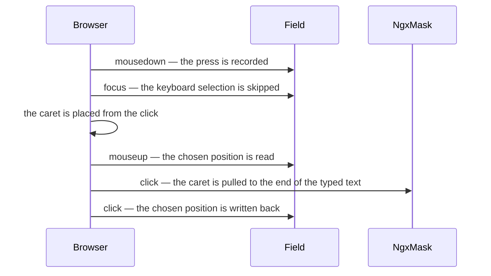

# Caret

How the editable fields place the caret on focus entry, and what they are working against. The rules themselves, as a consumer reads them, are in `user/fields.md`.

The library does two things and leaves the rest to the browser. Everything else a field could do here is either already native or actively worse.

---

## What Is Left To The Browser

A click already places the caret where it landed, in every engine, and a `textarea` already takes a caret rather than a selection. Neither is worth touching.

The keyboard half is not safe to inherit. Whether focus arriving by `Tab` selects an `input`'s content is engine behaviour a form library should not be passing on to its consumers. So the library selects, and the result is the same whether or not the browser would have.

That choice is deliberately independent of event ordering. A browser may place a click's caret before it dispatches `focus` or after; because the selection is never made for a press in the first place, neither order changes the outcome.

| Behaviour                  | Verified                               |
| :------------------------- | :------------------------------------- |
| Click, masked and unmasked | Chrome and Firefox, with trusted input |
| Keyboard selection         | Chrome, with trusted input             |

Headless Firefox dispatches no focus events at all, and Safari's driver needs Remote Automation enabled by hand, so the keyboard half is unverified there. It is written not to depend on them.

---

## The One Thing The DOM Does Not Say

A field cannot ask whether focus came from the keyboard or a pointer. `:focus-visible` is not the answer: it matches a text input on a pointer focus too, because the input takes keyboard input either way. So `BaseFieldDirective` records a `mousedown` on the editor and clears it from a timer, which is the first point after the whole press.

That flag is what `selectOnKeyboardFocus` checks. It is deliberately ordering-independent: it does not matter whether a browser places the click caret before or after it dispatches `focus`, because the selection is never made for a press in the first place.

`textarea-field` binds none of it and keeps the browser's own behaviour, because selecting a paragraph on the way in puts it one keystroke from being wiped.

---

## Undoing The Mask

`NgxMaskDirective` pulls `selectionStart` back to the end of the typed text on a `click` listener of its own, so a click on one of the empty slots it renders lands short of where it was aimed.

Angular registers a directive's host listeners before a template's on the same element, so the field's `(click)` runs after ngx-mask's and has the last word. Reading on `mouseup` and writing on `click` therefore needs no timer, and nothing is ever left queued to reach back over what the user does next.

`dropSpecialCharacters` decides how much the clamping bites. `date-field` and `time-field` keep their separators, so the mask counts the whole display and clamps less; `input-field` defaults to dropping them, which is where it is worst.

---

## Where The Value Ends

`endOfMaskedValue` in `helpers/input.helpers.ts` is the only rule with any arithmetic in it, and both jobs use it: the keyboard selection stops there, and a click is clamped to it.

A display with no placeholder left is all content, trailing literals included. One with placeholders left ends after the last filled position — and the separator drawn between that position and the first empty slot belongs to the unused area, so `079 123 __ __` ends at 7, not 8 or 13.

Which character marks an empty slot is ngx-mask's `placeHolderCharacter`, and it is settable. Every masked field therefore **binds** it rather than inheriting it, so a global `provideNgxMask` cannot change what the library reads its values out of while the library carries on looking for `_`. `BaseFieldDirective.maskPlaceholderCharacter` is what the caret rules ask; `input-field` and `textarea-field` override it from their merged config, and the date and time fields pin it.

One combination cannot be made to work: a placeholder the mask can also produce as content, through a token pattern that accepts it or a literal in the mask. The rendered text is then genuinely ambiguous, and no reading of it can be right. `isPlaceholderAmbiguous` detects exactly that and the two mask fields warn, naming the field and the character.

---

## Invariants

- The rules run on focus entry and never again. Nothing re-applies them on a repaint, a value change or a second click.
- A caret never lands behind the value. A click aimed into the unused slots collapses at the end of what is filled.
- Focusing a field does not change its value. `date-field` hands its display to ngx-mask only while nothing has been typed, because a half-typed date survives a blur onto the field's own panel and is there to come back to.
- `dropdown-field` and `select-field` are out of scope: their editors are `readonly`, so there is no caret to place.
