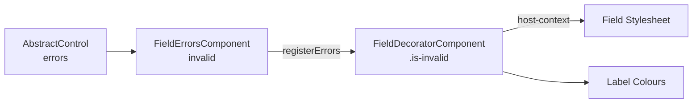
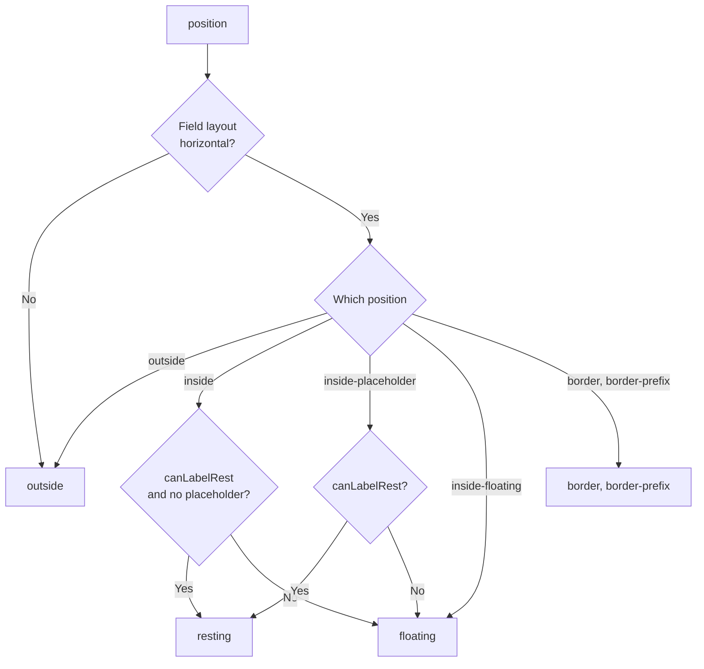

# Decoration

How a field, the decorator around it and its error messages are wired together. What a consumer does with the slots is in `user/decoration.md`, which this file does not restate.

`FieldDecoratorComponent` renders everything around a field and nothing inside it. The field is projected, so the decorator reads it rather than configuring it. Every value below is pulled off `IFormidableField`, never pushed in.
It does not itself implement that contract: the interface is signal-typed, while the decorator's mirrors are plain getters. They are reactive all the same — every one bottoms out in a `contentChild()` query or a signal on the field, and a signal read inside a getter is tracked by whichever view calls it, which is what lets the decorator be `OnPush`.
What paints over what is a separate concern; see `tech/layering.md`.

## The Three Parties

| Party                     | Owns                                                                                    |
| :------------------------ | :-------------------------------------------------------------------------------------- |
| `FieldDecoratorComponent` | The label, its adornment, the prefix and suffix wrappers, the hint row, the errors slot |
| The field                 | Its own box, its value, its panel, and the ARIA ids for what lives inside that box      |
| `FieldErrorsDirective`    | Creating the errors component, registering it, and pumping both repaints                |

None of them injects the others as a hard dependency. A field used without a decorator works; the decorator without a field renders empty; the errors directive without either renders beside its host control.

---

## The Slot

`errorsSlot` is a `ViewContainerRef` inside the decorator's template, below the container that positions the label and the adornments. `FieldErrorsDirective` creates its component into that slot, so the messages land below the field rather than inside the box whose geometry the label depends on. Without a decorator it falls back to its own `ViewContainerRef`, rendering beside the host control.

**The query is readable whatever the hook order.** The directive reads `errorsSlot` from its own `ngAfterViewInit`, which may run before or after the decorator's. A signal query is a `computed` over the view's own query data, materialized on read and bound during the view's **creation** pass — so it resolves from `ngOnInit` onward, exactly as the `static: true` query it replaced did, and needs no flag to say so.

The component is created with the **directive's** injector, not the slot's. Only the DOM anchor moves; `FORMIDABLE_ERROR_EXTRACTOR` and `FORMIDABLE_ERROR_TRANSLATOR` resolve the same either way.

The slot is an `aria-live="polite"` region, so a message appearing is announced without stealing focus.

## The Registration

Validity is computed in `FieldErrorsComponent`, which weighs the control's errors against `revealOn`. It is needed as a **host class** on the decorator, because that is the one element every stylesheet can reach: the decorator owns the label, and a projected field reads the same class with `:host-context(.is-invalid)`.

`registerErrors()` is the only call in the chain, made once from the directive's `ngAfterViewInit`. A field used without a decorator therefore gets its messages but no invalid styling, because there is no host to carry the class.

## The Ids

Every id in the library derives from one `fieldId`, minted per field instance from a module-level counter in `base-field.directive.ts`.

| Id                     | Minted by                  | Named by                            |
| :--------------------- | :------------------------- | :---------------------------------- |
| `{fieldId}-label`      | Decorator                  | The field's `aria-labelledby`       |
| `{fieldId}-hint`       | Decorator                  | The field's `aria-describedby`      |
| `{fieldId}-errors`     | Decorator                  | The field's `aria-describedby`      |
| `{fieldId}-panel`      | `BaseFieldDirective`       | A panel field's `aria-controls`     |
| `{fieldId}-option-{i}` | `BaseOptionFieldDirective` | The field's `aria-activedescendant` |

Fields read the decorator's ids back by injecting it **optionally**, so a field used on its own emits no attribute rather than a dangling reference.

**`aria-describedby` names both wrappers unconditionally.** They always render, and a reference to a hidden or empty element adds nothing to the accessible description, so there is no state here to keep in step.

**`aria-labelledby`** is what the `vertical` layout has instead of a `<label for>` its `div` label cannot be, and is the toggle's only accessible name — the toggle's `[id]` sits on its hidden checkbox while the focusable element is the `role="switch"` div.

`optionId(index)` returns `null` for a negative index, which is what makes a field with nothing highlighted emit no `aria-activedescendant` at all.

## The Repaint Pump

Angular's own form state is not signal-backed: `AbstractControl.errors`, `touched` and `dirty`, and `NgForm.submitted`, are plain properties, and nothing about reading them tells a view when they moved. `FieldErrorsComponent` derives everything it renders from them, so something has to tell it. `FieldErrorsDirective` merges three sources and calls `refresh()` on any of them.

| Source                 | Why it cannot be inferred                                                                       |
| :--------------------- | :---------------------------------------------------------------------------------------------- |
| The control's `events` | Gated behind the form's `idle$` when there is a form directive — see below                      |
| `NgForm.ngSubmit`      | `NgForm.submitted` is untracked, and `revealOn: 'submitted'` gates the messages on it           |
| `revealOn` as a signal | It belongs to the form directive, not to this component, so a change to it reaches nothing here |

**The `idle$` gate.** Async validation leaves the form `PENDING` with the new errors not yet readable, so the control's events alone would repaint too early. With a form directive present, the events are resubscribed per settle, `startWith(null)` so each settle repaints once — under `updateOn: 'submit'` the touches land while the form is still pending and would otherwise never paint. Without a form directive — Angular's own validators, or none — the events are already the signal, because a synchronous validator has no such gap.

**`refresh()` bumps a revision signal**, and `errors` and `invalid` are `computed`s over it. That is what makes one call repaint three views that are not related to each other: the messages here, the decorator's `is-invalid` host class, and the field's `aria-invalid` — which is the errors component's **sibling**, a boundary `markForCheck` could never cross and a signal read does not even see. `invalid` reads the revision itself and not only `errors()`: a control can become touched, dirty or submitted without its errors moving, and `errors()` is reference-equal across such a change.

**The group's control is resolved lazily.** An `ngModelGroup` registers its control a microtask after `ngAfterViewInit`, so the event stream is wrapped in `defer` — resolving it eagerly would leave a group's errors component with nothing to repaint on.

## `OnPush`, And What It Took

The decorator renders nothing of its own. `labelState` is a getter over the projected field's `readonly`, `disabled`, `placeholder` and mask configuration — none of them the decorator's inputs, so nothing about the decorator changes when they do. It was therefore the one component in the library checked every cycle, and under `OnPush` the label silently kept a stale state whenever a consumer changed one of them at runtime.

What makes `OnPush` work now is that every value it reads is a signal, and the read itself is what marks this view. Three things had to move for that to be true of all of them:

| Read                                              | Was                                | Is                                    |
| :------------------------------------------------ | :--------------------------------- | :------------------------------------ |
| The projected field, label, adornments            | `@ContentChild`                    | `contentChild()`                      |
| `canLabelRest`, `isPanelOpen`, `hasInFieldToggle` | plain getters on the field         | signals on `IFormidableField`         |
| `invalid`                                         | a getter over Angular's form state | a `computed` over the pump's revision |

A getter is still a getter — `hasLabel`, `labelState`, `valueAlignment` — and still the right shape: a signal read inside one is tracked by the caller, and unlike the field contract these are internal to one file. The projected decorations stay getters for the original reason too: a consumer adds and removes one at runtime with `@if`, and a value latched in `ngAfterContentInit` would leave its wrapper shown — or hidden — forever.

Proven by `on-push.spec.ts`, which asserts against the decorator's **template** and never its host classes — host bindings are evaluated in the parent's view, which a `detectChanges()` re-runs whatever the strategy, so a host class would pass either way and prove nothing.

## The Label State

A label's configured `position` is a request. `labelState` resolves it against the field, and is the only thing the template and the host classes read.

**Only `horizontal` has room.** Every position other than `outside` needs a field box with space for a label in it. The toggle is `inline` and the groups and the slider are `vertical`, so all of them fall back to `outside` whatever a consumer sets.

**The placeholder is the position's call, not the field's.** `canLabelRest` reports only what the field renders of its own accord — its value, or mask slots. Whether a `placeholder` blocks a resting label (`inside`) or is hidden behind one (`inside-placeholder`) depends on the position, which the field cannot see.

The derived host classes and flags:

| Name                 | Means                                                                                     |
| :------------------- | :---------------------------------------------------------------------------------------- |
| `.label-inside`      | `resting` or `floating` — the label sits over the value area, which must stay clear of it |
| `.label-resting`     | `resting` — the label stands in for the placeholder, so the field renders none            |
| `isLabelOverField`   | Any state but `outside` — the label is out of normal flow                                 |
| `showsBeforeWrapper` | The row above the field is needed at all: a label or an adornment, still in flow          |

**The adornment collapses with the label.** An adornment decorates the label, so once the label has moved over the field an adornment left in the row above would be stranded next to a field it no longer belongs to.

**`isLabelAnimated` gates the transition** the shared `field-label` mixin declares, and is released one `requestAnimationFrame` after the first render. `NgModel` writes through a microtask, so the first render of **any** field with an initial value happens before it has one: the label renders resting and is corrected to floating a moment later, and that correction is nobody's state change. A frame and not a microtask, because every option field resolves its projected options in a `queueMicrotask` and only a frame is reliably after all of them.

## The Inset Measure

A projected prefix or suffix takes horizontal space from inside the field's box. The field's padding and the bounds of a label rendered over its value both have to clear it, and neither is a length the library can know.

The measurement is the wrapper, not the content. Each wrapper shrink-wraps what is projected into it, so the wrapper's own width — its padding included — is the whole inset, and it collapses to zero the moment nothing is projected.

| Step    | Detail                                                                                        |
| :------ | :-------------------------------------------------------------------------------------------- |
| Observe | A `ResizeObserver` on both wrappers, `horizontal` layout only                                 |
| Run     | Writes custom properties only, so it needs no change-detection pass of its own                |
| Write   | `--formidable-field-prefix-inset` and `--formidable-field-suffix-inset` on the decorator host |
| Clear   | `removeProperty` at zero width, not a `0px` write                                             |

**`removeProperty` and not `0px`.** Removing the property is what lets the field's own padding apply again; writing a zero would override it with nothing.

`ResizeObserver` covers every way the width moves — content added or removed, a font finishing loading, the wrapper hidden — which a one-off measurement in a lifecycle hook does not.

**The in-field toggle is a class, not a measurement.** An in-field toggle is a fixed-size square at the field's inner trailing edge, so `.has-in-field-toggle` becomes an inset in the stylesheet instead. That also spares a re-measure every time `readonly` or `disabled` adds or removes the toggle. The inset says how much room the field's trailing edge claims, not how the field lays the toggle out — `select-field` overlays its arrow on a native `<select>` rather than placing it beside the value, and declares the same class.

---

## Invariants

- **The decorator never writes to the field.** Every value it renders is read off `IFormidableField`. A field that must behave differently decides that itself, through `decoratorLayout`.
- **Both directions of the injection are optional.** The field injects the decorator optionally and the decorator queries the field as content. Either alone renders.
- **The ids have one stem.** Everything derives from `fieldId`. An id minted any other way cannot be resolved by the party that has to name it.
- **The pump ends at a signal.** Any new state derived from Angular's form state belongs in a `computed` over the revision `refresh()` bumps. Reading the control from a plain getter leaves it unable to repaint anything.
