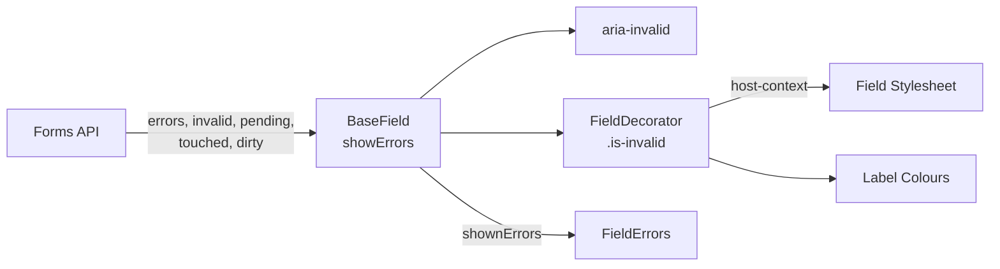
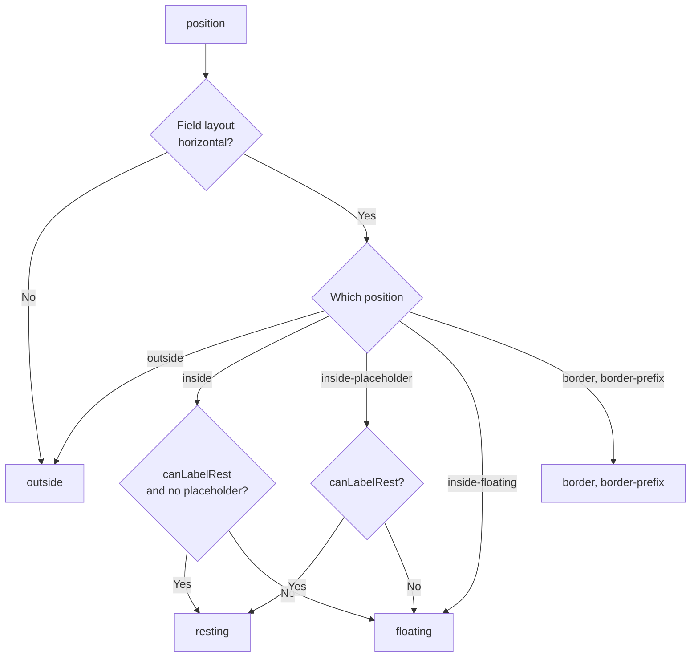

# Decoration

How a field, the decorator around it and its error messages are wired together. What a consumer does with the slots is in [`user/decoration.md`](../user/decoration.md), which this file does not restate.

`FieldDecorator` renders everything around a field and nothing inside it. The field is projected, so the decorator reads it rather than configuring it. Every value below is pulled off `FormidableField`, never pushed in. It does not itself implement that contract: the interface is signal-typed, while the decorator's mirrors are plain getters. They are reactive all the same: every one bottoms out in a `contentChild()` query or a signal on the field, and a signal read inside a getter is tracked by whichever view calls it, which is what lets the decorator be `OnPush`. What paints over what is a separate concern; see [`tech/layering.md`](layering.md).

## The Three Parties

| Party            | Owns                                                                                    |
| :--------------- | :-------------------------------------------------------------------------------------- |
| `FieldDecorator` | The label, its adornment, the prefix and suffix wrappers, the hint row, the errors slot |
| The field        | Its own box, its value, its panel, and the ARIA ids for what lives inside that box      |
| `FieldErrors`    | The message list and its live region: what to render, never when                        |

None of them injects the others as a hard dependency. A field used without a decorator works; the decorator without a field renders empty; `FieldErrors` without either renders what it is given.

---

## The Slot

The decorator renders a `formidable-field-errors` below the container that positions the label and the adornments, bound to the field's `shownErrors`, so the messages land below the field rather than inside the box whose geometry the label depends on. It renders whether or not there is a message, so its `aria-live="polite"` region exists before the first one arrives and is announced without stealing focus.

## The Invalid State

The field decides when its errors show. `showErrors` weighs the errors and `invalid` the forms API wrote into it against its reveal, as [`tech/forms-integration.md`](forms-integration.md) describes, and every consumer of it reads the same signal:

```mermaid
flowchart LR
  Api[Forms API] -->|errors, invalid, pending,<br/>touched, dirty| Field[BaseField<br/>showErrors]
  Field --> Aria[aria-invalid]
  Field --> Decorator[FieldDecorator<br/>.is-invalid]
  Field -->|shownErrors| Messages[FieldErrors]
  Decorator -->|host-context| Styles[Field Stylesheet]
  Decorator --> Label[Label Colours]
```

`.is-invalid` sits on the decorator because that is the one element every stylesheet can reach: the decorator owns the label, and a projected field reads the same class with `:host-context(.is-invalid)`. A field used without a decorator therefore reports `aria-invalid` but has no invalid styling and renders no messages.

## The Ids

Every id in the library derives from one `fieldId`, minted per field instance from a module-level counter in `base-field.ts`.

| Id                     | Minted By         | Named By                            |
| :--------------------- | :---------------- | :---------------------------------- |
| `{fieldId}-label`      | Decorator         | The field's `aria-labelledby`       |
| `{fieldId}-hint`       | Decorator         | The field's `aria-describedby`      |
| `{fieldId}-errors`     | Decorator         | The field's `aria-describedby`      |
| `{fieldId}-panel`      | `BaseField`       | A panel field's `aria-controls`     |
| `{fieldId}-option-{i}` | `BaseOptionField` | The field's `aria-activedescendant` |

Fields read the decorator's ids back by injecting it **optionally**, so a field used on its own emits no attribute rather than a dangling reference.

**`aria-describedby` names both wrappers unconditionally.** They always render, and a reference to a hidden or empty element adds nothing to the accessible description, so there is no state here to keep in step.

**`aria-labelledby`** is what the `vertical` layout has instead of a `<label for>` its `div` label cannot be, and is the toggle's only accessible name: the toggle's `[id]` sits on its hidden checkbox while the focusable element is the `role="switch"` div.

`optionId(index)` returns `null` for a negative index, which is what makes a field with nothing highlighted emit no `aria-activedescendant` at all.

## Why Nothing Pumps

Every forms API writes the field's state inputs itself, and a signal input read in a `computed` repaints whatever reads `showErrors`. `[formField]` writes them from signals. `ngModel`, `[formControl]` and `formControlName` write them from the field's host view as it refreshes, and Angular marks that view whenever the control moves: its `valueChanges` and `statusChanges` call `markForCheck`, and `NgControlStatus`, behind the `ng-touched` classes, reads the control's touched, pristine and status signals in its host bindings. A touch the API makes itself, such as a submit's `markAllAsTouched`, therefore reaches a field inside an `OnPush` child with nothing listening for it.

## `OnPush`

The decorator renders nothing of its own. `labelState` is a getter over the projected field's `readonly`, `disabled`, `placeholder` and mask configuration, none of them the decorator's inputs, so nothing about the decorator changes when they do. A plain read of any of them would leave the label stale under `OnPush` whenever a consumer changes one at runtime.

`OnPush` works because every value the decorator reads is a signal, and the read itself is what marks this view:

| Read                                              | Source                       |
| :------------------------------------------------ | :--------------------------- |
| The projected field, label, adornments            | `contentChild()`             |
| `canLabelRest`, `isPanelOpen`, `hasInFieldToggle` | signals on `FormidableField` |
| `showErrors`, `shownErrors`                       | signals on `FormidableField` |

A getter, such as `hasLabel`, `labelState` or `valueAlignment`, is still the right shape: a signal read inside one is tracked by the caller, and unlike the field contract these are internal to one file. The projected decorations are read through getters too: a consumer adds and removes one at runtime with `@if`, and a value latched in `ngAfterContentInit` would leave its wrapper shown, or hidden, forever.

Proven by the decorator's `repaint.spec.ts`, which asserts against the decorator's **template** and never its host classes: host bindings are evaluated in the parent's view, which the host's own signal write refreshes anyway, so a host class would pass either way and prove nothing.

## The Label State

A label's configured `position` is a request. `labelState` resolves it against the field, and is the only thing the template and the host classes read.

```mermaid
flowchart TD
  Start[position] --> Layout{Field layout<br/>horizontal?}
  Layout -->|No| Outside[outside]
  Layout -->|Yes| Which{Which position}
  Which -->|outside| Outside
  Which -->|inside| Rest{canLabelRest<br/>and no placeholder?}
  Which -->|inside-placeholder| RestP{canLabelRest?}
  Which -->|inside-floating| Float[floating]
  Which -->|border, border-prefix| Border[border, border-prefix]
  Rest -->|Yes| Resting[resting]
  Rest -->|No| Float
  RestP -->|Yes| Resting
  RestP -->|No| Float
```

**Only `horizontal` has room.** Every position other than `outside` needs a field box with space for a label in it. The toggle is `inline` and the groups and the slider are `vertical`, so all of them fall back to `outside` whatever a consumer sets.

**The placeholder is the position's call, not the field's.** `canLabelRest` reports only what the field renders of its own accord: its value, or mask slots. Whether a `placeholder` blocks a resting label (`inside`) or is hidden behind one (`inside-placeholder`) depends on the position, which the field cannot see.

The derived host classes and flags:

| Name                 | Means                                                                                    |
| :------------------- | :--------------------------------------------------------------------------------------- |
| `.label-inside`      | `resting` or `floating`: the label sits over the value area, which must stay clear of it |
| `.label-resting`     | `resting`: the label stands in for the placeholder, so the field renders none            |
| `isLabelOverField`   | Any state but `outside`: the label is out of normal flow                                 |
| `showsBeforeWrapper` | The row above the field is needed at all: a label or an adornment, still in flow         |

**The adornment collapses with the label.** An adornment decorates the label, so once the label has moved over the field an adornment left in the row above would be stranded next to a field it no longer belongs to.

**`isLabelAnimated` gates the transition** the shared `field-label` mixin declares, and is released one `requestAnimationFrame` after the first render. `NgModel` writes through a microtask, so the first render of **any** field with an initial value happens before it has one: the label renders resting and is corrected to floating a moment later, and that correction is nobody's state change. A frame and not a render hook, because every option field resolves its projected options in a render hook of its own and only a frame is reliably after all of them.

## The Inset Measure

A projected prefix or suffix takes horizontal space from inside the field's box. The field's padding and the bounds of a label rendered over its value both have to clear it, and neither is a length the library can know.

The measurement is the wrapper, not the content. Each wrapper shrink-wraps what is projected into it, so the wrapper's own width, its padding included, is the whole inset, and it collapses to zero the moment nothing is projected.

| Step    | Detail                                                                                        |
| :------ | :-------------------------------------------------------------------------------------------- |
| Observe | A `ResizeObserver` on both wrappers, `horizontal` layout only                                 |
| Run     | Writes custom properties only, so it needs no change-detection pass of its own                |
| Write   | `--formidable-field-prefix-inset` and `--formidable-field-suffix-inset` on the decorator host |
| Clear   | `removeProperty` at zero width, not a `0px` write                                             |

**`removeProperty` and not `0px`.** Removing the property is what lets the field's own padding apply again; writing a zero would override it with nothing.

`ResizeObserver` covers every way the width moves (content added or removed, a font finishing loading, the wrapper hidden), which a one-off measurement in a lifecycle hook does not.

**The in-field toggle is a class, not a measurement.** An in-field toggle is a fixed-size square at the field's inner trailing edge, so `.has-in-field-toggle` becomes an inset in the stylesheet instead. That also spares a re-measure every time `readonly` or `disabled` adds or removes the toggle. The inset says how much room the field's trailing edge claims, not how the field lays the toggle out: `select-field` overlays its arrow on a native `<select>` rather than placing it beside the value, and declares the same class.

---

## Invariants

- **The decorator never writes to the field.** Every value it renders is read off `FormidableField`. A field that must behave differently decides that itself, through `decoratorLayout`.
- **Both directions of the injection are optional.** The field injects the decorator optionally and the decorator queries the field as content. Either alone renders.
- **The ids have one stem.** Everything derives from `fieldId`. An id minted any other way cannot be resolved by the party that has to name it.
- **Form state comes in through inputs.** A field reads the forms API's state only from the inputs the API writes. Nothing in the library reads a control, so nothing has to be told when one moves.
