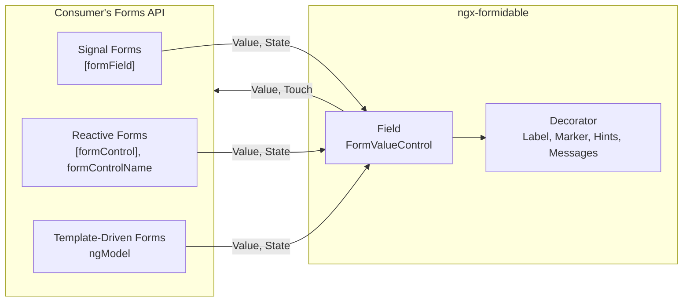
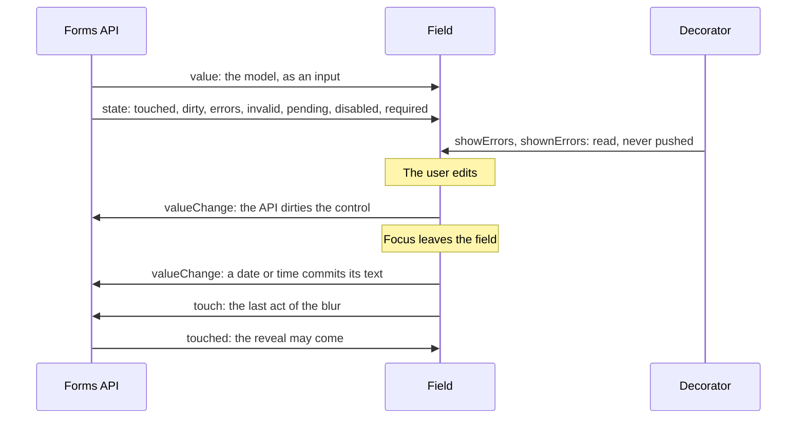
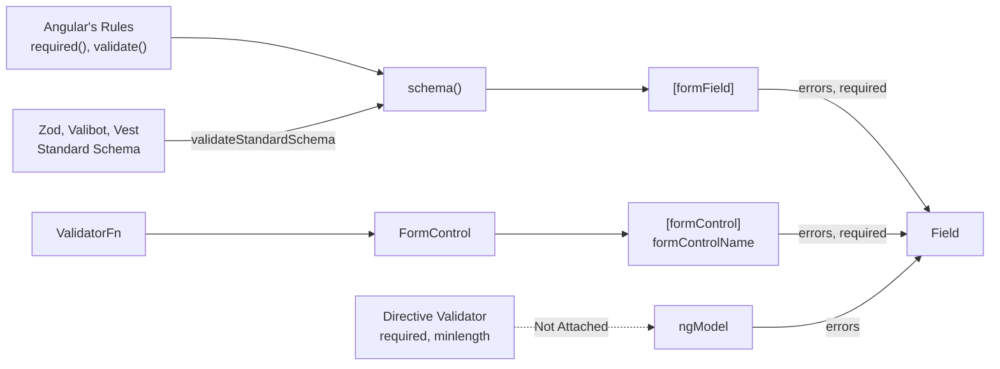

# Forms Integration

How a field meets Angular's three forms APIs, and why the library holds no validation of its own. What a consumer writes is in [`user/forms.md`](../user/forms.md) and [`user/validation.md`](../user/validation.md); what the decorator does with a field's state is in [`tech/decoration.md`](decoration.md).

## Ownership

The forms API holds the model, its state and its rules. The field edits the model and renders the state; the decorator reads the field.

| Concern                                                                  | Owner                                                          |
| :----------------------------------------------------------------------- | :------------------------------------------------------------- |
| The model, the value flow, the rules, when they run, submission          | The forms API and the consumer's validator                     |
| Touched, dirty, errors, pending, disabled, readonly, required            | The forms API, written into the field's `FormUiControl` inputs |
| Editing, keyboard, masking, panels, ARIA                                 | The field                                                      |
| Label, required marker, hints, prefix, suffix, messages and their reveal | The decorator, reading its field                               |
| Message text                                                             | `FORMIDABLE_ERROR_MESSAGE`                                     |

---

## The Field Contract

`BaseField<T>` implements Angular's `FormValueControl<T>`: `value` is a `model()`, the `FormUiControl` state is a set of inputs, and `touch` is an output. Angular's custom-control integration binds exactly that under every API, so no field provides `NG_VALUE_ACCESSOR`.

| Member                                                         | `[formField]`                    | `[formControl]`, `formControlName`     | `ngModel`                                             |
| :------------------------------------------------------------- | :------------------------------- | :------------------------------------- | :---------------------------------------------------- |
| `value`, written in                                            | The field state's value          | `control.value`                        | `control.value`                                       |
| `value`, edited out                                            | The field state's value, dirtied | `markAsDirty()`, then `setValue()`     | `markAsDirty()`, `setValue()`, `ngModelChange`        |
| `touch`                                                        | `markAsTouched()`                | `markAsTouched()`                      | `markAsTouched()`                                     |
| `touched`, `dirty`, `invalid`, `pending`, `disabled`, `errors` | Written                          | Written                                | Written                                               |
| `required`                                                     | `required()` or `REQUIRED`       | A `Validators.required` on the control | Not written: the `required` attribute binds the input |
| `readonly`                                                     | `readonly()`                     | Not written: bound by hand             | Not written: bound by hand                            |
| `name`, `min`, `max`, `minLength`, `maxLength`                 | Written from the schema          | Not written                            | Not written: the `name` attribute binds the input     |

**Errors Differ In Shape**: `[formField]` writes its rules' own `ValidationError`s, `message` included. The classic APIs write each key of `control.errors` as `{ kind, context }`, with no `message`.

Every field keeps to four rules, and each API relies on them:

- **Touch Last**: `touch` is the last act of a blur. `BaseField.onFocusChange` calls `doOnFocusChange` first, so a field that commits on blur, as `date-field` and `time-field` do, has written its value before the touch, which is what Signal Forms' `debounce(path, 'blur')` releases it on.
- **Only The User Writes The Model**: a field writes its `value` model only for a user's edit, through `setValue`, which writes nothing for an edit equal to the model. A programmatic write is an input write, so it reports nothing, touches nothing and dirties nothing, and the field corrects nothing it is given: no clamp, no re-mask, no reconcile against the options.
- **A Write Does Not Take The Caret**: a text field writes through `replaceText`, which leaves the element alone when it already shows that text and collapses the caret behind the text only when it replaced something. A consumer that echoes its model back writes the displayed value on every keystroke, and the caret and selection stay the user's.
- **A Blur Leaves The Field**: focus moving between a field's own elements is no blur: `onFocusChange` ignores a `focusout` whose `relatedTarget` is inside `fieldRef`. A press inside a panel keeps focus in the input, a pick from a panel neither commits nor touches, and only `date-field`'s month and year selects take focus, which returns to the input before Pikaday redraws them.

A touch is not cosmetic: it is what `revealOn="touched"` reads, so a touch nobody made would reveal a field nobody has visited. Dirty is not cosmetic either: it is what `revealOn="dirty"` reads.

`field-contract.spec.ts` runs every field through all three APIs against this contract.

---

## Value And State Flow

Every input is a signal and `showErrors` is a `computed` over them, so a state change repaints on its own. What that one signal reaches, and why no classic API needs pumping, is in [`tech/decoration.md`](decoration.md).

Text a date or time field cannot parse stays as typed. `transformedValue` reports it to the API as a `parse` error and leaves the model alone.

---

## Validators

Each validator reaches a field through its forms API, never through the library.

| Validator                   | Where It Goes                                                                                                                          | Marks Required                                           |
| :-------------------------- | :------------------------------------------------------------------------------------------------------------------------------------- | :------------------------------------------------------- |
| Angular's rules, by default | The `schema()`: `required()`, `email()`, `pattern()`, `maxLength()`; `validate()` across fields; `validateAsync()` or `validateHttp()` | `required()`                                             |
| Zod, Valibot, Vest          | The `schema()`: `validateStandardSchema(path, schema)`, with a Vest suite created per form                                             | Not on its own: `required()`, or `REQUIRED` to mark only |
| A classic `ValidatorFn`     | The `FormControl`, under `[formControl]` or `formControlName`                                                                          | `Validators.required`                                    |
| A directive validator       | Nowhere: no classic API attaches one to a custom control                                                                               | The `required` attribute                                 |

- **Standard Schema Is Signal Forms Only**: `validateStandardSchema` exists only in `@angular/forms/signals`. Under `[formControl]` or `formControlName`, a Zod, Valibot or Vest schema runs inside a hand-written `ValidatorFn` or `AsyncValidatorFn`, and its message reaches the field only through `context`, which `FORMIDABLE_ERROR_MESSAGE` reads.
- **One Owner Per Check**: more sources combine as more rules in one schema. Each check has one owner, or a field reports the same failure twice.
- **The Library's Part**: the message text, the reveal, the placement and the marker, all of it read off the field's state.
- **Message Text**: `FORMIDABLE_ERROR_MESSAGE` turns an error into its text, defaulting to `message ?? kind`. A classic error carries no `message`, so the token is where its `kind` and `context` become one.

---

## Reveal

**Run** is when a rule runs and **reveal** is when its messages appear. They have separate owners.

| Axis   | Owner         | Mechanism                                                     | Read By                |
| :----- | :------------ | :------------------------------------------------------------ | :--------------------- |
| Run    | The forms API | Signal Forms' `debounce()`; every edit under the classic APIs | The forms API          |
| Reveal | The library   | `revealOn`                                                    | `BaseField.showErrors` |

- **Resolution**: the field's own `revealOn`, then the nearest `FORMIDABLE_DEFAULTS.revealOn`, then `touched`. The default is read once, when the field is created; the input is read live.
- **Invalid Without Errors**: a field the API holds `invalid` shows invalid once revealed, with no message.
- **Pending Keeps The Last Errors**: while `pending`, `shownErrors` holds the last settled errors, so the messages do not flicker away and back on every run.
- **No `submitted`**: Signal Forms keeps no submitted state, and `submit()` touches every field, so `touched` covers a submit. A classic `ngSubmit` touches no control, so a classic form reveals on a submit only once it calls `markAllAsTouched()`.

---

## Angular Behaviour Relied On

Each is pinned by a spec, so an Angular update that changes it fails one.

| Behaviour                                                                                                                                              | Pinned By                                           |
| :----------------------------------------------------------------------------------------------------------------------------------------------------- | :-------------------------------------------------- |
| `[formField]` writes `name`, `readonly`, `disabled`, `required`, `min`, `max`, `minLength` and `maxLength` into the same-named inputs                  | `field-contract.spec.ts`, `forms-api-state.spec.ts` |
| `ngModel` and `[formControl]` bind a custom control with no value accessor and write `touched`, `dirty`, `invalid`, `pending`, `disabled` and `errors` | `field-contract.spec.ts`, `reveal.spec.ts`          |
| The classic APIs ignore `updateOn` for a custom control, and write `required` everywhere but under `ngModel`                                           | `field-contract.spec.ts`                            |
| `ngModel` attaches no directive validator to a custom control's control                                                                                | `forms-api-state.spec.ts`                           |
| A classic error reaches a custom control as `{ kind, context }`, with no `message`                                                                     | `error-message.spec.ts`                             |
| `transformedValue` reports parse errors to all three APIs. `ngModel` and `[formControl]` hand one to the field only on the host's next check           | `date-time-field.spec.ts`                           |
| Signal Forms' `submit()` touches every field, and a classic `ngSubmit` touches no control                                                              | `reveal.spec.ts`                                    |
| A Vest suite is a Standard Schema, and an async Vest test does not surface through it                                                                  | `vest-integration.spec.ts`                          |
| A Standard Schema issue whose path names no field reports on the root, and one whose path runs through a key the model lacks throws                    | `vest-integration.spec.ts`                          |
| A Zod schema is a Standard Schema, and a refinement reports on the path it names                                                                       | `zod-integration.spec.ts`                           |

The last three are portal specs in `src/app/validation/`; the rest are library specs.

---

## Accepted Compromises

- **`updateOn` In The Classic APIs**: `blur` and `submit` do not hold back a library field's value. Signal Forms' `debounce(path, 'blur')` does, through `touch`.
- **Template-Driven Forms Validate No Field**: no classic API attaches a directive validator, such as `required` or `minlength`, to a custom control, so no validator declared in a template reaches a library field under `ngModel`. The `required` attribute still marks, because it binds the field's `required` input as well. The upstream report is in [`impl/backlog.md`](../impl/backlog.md).
- **Required Checkbox Group**: Signal Forms' `required()` does not count `[]` as empty, so a required `checkbox-group-field` pairs it with `minLength(path, 1)`.

---

## What The Library Leaves Out

- **No Value Accessor**: both integrations prefer a value accessor to a custom control. The classic `NgControl` skips its custom-control path when one is provided, and `[formField]` then binds through an interop `NgControl` with no `markAs*`, `events` or `valueChanges`. A field that was both would receive none of its state inputs under any API. `FormValueControl` alone is bound the same way by all three.
- **No Form Harness**: the model, the rules, a rule across fields, debouncing and submission are the forms API's: Signal Forms' `schema()`, `validate()` on a group or the root, `debounce()` and `submit()`; a `FormGroup` in the classic APIs. A library form directive would restate them and tie the fields to the one API it wraps. The two form-wide settings, `revealOn` and `hideRequiredMarkers`, are `FORMIDABLE_DEFAULTS` entries, which a component provides over its subtree.
- **No Validator Package**: `validateStandardSchema` runs any Standard Schema, and Vest, Zod and Valibot are Standard Schemas, so an adapter would wrap a single call. The package has one entry point and no validation library among its peers. `vest` and `zod` are dev dependencies, for the Studio's export and the integration specs.

`validation.model.ts` is therefore the library's whole validation vocabulary: `FormidableReveal`, `FormidableErrorMessageFn` and `FORMIDABLE_ERROR_MESSAGE`.
