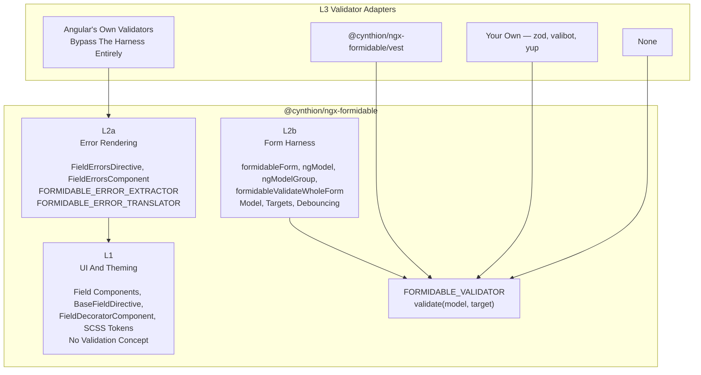

# Validation Architecture

Why the library carries no validation library, and where the seam sits.

## Three Layers



| Layer | Owns                                                         | Knows About A Validator |
| :---- | :----------------------------------------------------------- | :---------------------: |
| L1    | Rendering, theming, masking, keyboard, ARIA                  |           No            |
| L2a   | Turning `AbstractControl.errors` into displayed messages     |           No            |
| L2b   | The model, targets, debouncing, async validator registration |           No            |
| L3    | The validation rules                                         |           Yes           |

## The Two Universal Channels

Nothing in L1 or L2a is coupled to a validator because both rest on things Angular already guarantees:

- **`AbstractControl.errors`** — every validator writes here. `FieldErrorsComponent` reads it and nothing else, through `FORMIDABLE_ERROR_EXTRACTOR`; `getAllFormErrors` runs every entry through the same extractor, so `errorsChange` is one homogeneous `FormidableFormErrors` map however many validators wrote into it.
- **`.is-invalid`** — one class on `FieldDecoratorComponent`'s host, computed from the messages and the reveal setting that gates them. The whole SCSS state layer hangs off it, and it means nothing about who decided the field was invalid.

`FORMIDABLE_ERROR_EXTRACTOR` is what makes `AbstractControl.errors` genuinely universal. The harness writes `{ error, errors }`; Angular's validators write `{ required: true }`; a schema library writes something else. The extractor's default handles the first two and an override handles the third, so the same UI serves all of them.

One naming trap worth knowing: `IFormidableValidator.validate(model, target)` and Angular's `AsyncValidator.validate(control)` share a method name. No class in the library implements both — the three validator directives are `AsyncValidator`s, the Vest directive is an `IFormidableValidator` — and TypeScript rejects it loudly if one ever tries.

## Why The Seam Is Where It Is

`createAsyncValidator` in `form.directive.ts` does five things. Four are generic:

1. Assemble the model. (See **The Model A Rule Sees** below.)
2. Patch the changed value in at the control's dotted target.
3. Debounce per the form's `debounceMs`, read afresh on every run.
4. **Run the rules.** ← the only validator-specific step
5. Map the result into `ValidationErrors`.

So the seam is a single method that takes `(model, target)` and returns messages. A validator is the smallest thing that can exist — the Vest one is about thirty lines, all of it the `suite.runStatic(model, target)` call and the `getErrors(target)` read off its result.

Putting the seam any lower would force each adapter to re-implement path computation and debouncing. Putting it any higher would drag the validator's own types into `form.directive.ts`.

## The Model A Rule Sees

The form's **live control values lead**, and `formValue` fills in only what has no control of its own. It cannot be the other way round: Angular calls `_runAsyncValidator` before it emits the `ValueChangeEvent` that `formValueChange` turns into the next `formValue`, so the bound model is one change behind at the moment a rule runs.

That is also why `formValue` is optional at every moment, including the first. A form whose model arrives through `| async`, or never binds one at all, validates against its control values alone.

`mergeValuesAndRawValues` supplies the live values, so a disabled control is included. `fillMissing` overlays `formValue` under them: it writes a key only where the target has none, so a cleared control's `null` stands rather than yielding to the value the model still holds.

Step 2 is what keeps the target itself current. A field's or a group's own validator runs during that control's own `updateValueAndValidity`, before the root recomputes its value, so its own target is the one place the live values lag.

## The Two Timing Axes

**Run** is when the validator runs, **reveal** is when the messages appear, and they are separate mechanisms with separate owners. Consumer-facing reference: `user/validation.md`.

| Axis     | Owner   | Mechanism    | Read by                        |
| :------- | :------ | :----------- | :----------------------------- |
| Run      | Angular | `updateOn`   | `AbstractControl`              |
| Reveal   | Library | `revealOn`   | `FieldErrorsComponent.invalid` |
| Debounce | Library | `debounceMs` | `createAsyncValidator`         |

### Why Run Gets No Input

`updateOn` resolves by walking to the parent when a control sets nothing of its own, so `ngFormOptions` already cascades and `ngModelOptions` already overrides. A library input would restate that and could drift from it, and it could not see a per-field `ngModelOptions` a consumer set directly. So no library code sits in that path.

### The Field Contract

The run axis only works because every field keeps to two rules. Angular commits a `blur` control's value from inside `onTouched`, and only when a change is already pending, so:

- **Touch Last**: `onTouched()` is the last act of a blur. `BaseFieldDirective.onFocusChange` calls `doOnFocusChange` first, so a field that commits on blur, as `date-field` and `time-field` do, has written its value before the touch that commits it.
- **Programmatic Paths Are Silent**: `runSilently(cause, work)` marks work the user did not cause, and both `touch()` and `commit()` respect it. Nothing on such a path touches the control or leaves it dirty.
- **A Field May Disown A Blur**: `ignoresBlur()` suppresses both the commit and the touch, for a field that moved focus onto something it owns. `date-field` does this so a control inside its panel stays clickable.

A touch is not cosmetic. Under `blur` it is the commit, and under `submit` it pre-sets the pending touch, so a touch nobody made would commit and reveal a field nobody has visited. Dirty is not cosmetic either: it is what `revealOn="dirty"` reads.

There are two causes, and they differ in one thing only:

| Cause        | Raised by                                      | Reports the value | Touches | Dirties |
| :----------- | :--------------------------------------------- | :---------------: | :-----: | :-----: |
| `write`      | `writeValue`                                   |        No         |   No    |   No    |
| `correction` | A reconcile, a clamped number, a masked string |        Yes        |   No    |   No    |

A write reports nothing because the form is where the value came from. A correction has to report, because the model holds a value the field cannot render: an option that no longer exists, a number off the step grid, an unmasked string.

Angular raises its pending dirty flag on every change a value accessor reports and offers no way to opt out, so `runSilently` puts a pristine control back. The two deferred corrections, `slider-field`'s clamp and the masked `doWriteValue`, run inside their own scope from the `queueMicrotask` or `setTimeout` that carries them, since the write scope has closed by then.

### Reveal Resolution And Repaint

`FieldErrorsComponent` resolves its own field's `revealOn` first, then the form's, then `touched`. `FieldErrorsDirective` pushes the field's value and drives the repaint, because none of the state the component reads is signal-backed: `AbstractControl.errors`, `touched` and `dirty` are plain properties, `NgForm.submitted` reads through `untracked`, and the form's `revealOn` is a signal on a directive the component does not own. All three join one stream, and each emission calls `refresh()` — which bumps the revision the component's `errors` and `invalid` computeds read. See `tech/decoration.md` for what that one signal then reaches.

### Debounce

`debounceMs` is read per run, inside a `timer` the validator returns. Angular cancels a control's pending async validator when the next run starts, so a newer change restarts the window; that cancellation is the debounce. There is no per-target cache to freeze the setting or to leak.

## Package Layout

```txt
projects/ngx-formidable/
├── src/                    → @cynthion/ngx-formidable      (L1, L2a, L2b)
│   └── lib/
│       ├── components/     L1 + L2a
│       ├── directives/     L1 — field-decoration attribute directives only
│       ├── forms/          L2b — the harness and its helpers
│       ├── helpers/        mask, input, format, position, option, utility
│       ├── models/         formidable.model.ts (UI) + validation.model.ts (the seam)
│       └── styles/
└── vest/                   → @cynthion/ngx-formidable/vest (L3)
```

`lib/forms/` holds the harness and its helpers; `directives/` holds the field-decoration attribute directives only. Everything under `forms/` is named `form*` and is reachable only from the harness.

`lib/forms/testing/stub-validator.directive.ts` is a test-only `FORMIDABLE_VALIDATOR` so the decorator specs can prove UI state travels from validity without pulling in a validation library. It is unreachable from `public-api.ts`, so ng-packagr never compiles it.

### `vest` As An Optional Peer

`vest` stays declared in the primary `package.json` — ng-packagr resolves every entry point's imports against it, and secondary entry points cannot declare their own dependencies. It is marked `peerDependenciesMeta.vest.optional`, which is what removes the forcing: npm neither installs nor warns about it.

What matters is that the type never reaches the main entry point. All of the main entry's `.d.ts` files are free of `vest`; exactly one file under `vest/` names it, and TypeScript only loads that file for a consumer who imports `@cynthion/ngx-formidable/vest`.

### Adding Another Adapter

A `/zod` entry point would be the same three files as `/vest`:

| File                                     | Content                                           |
| :--------------------------------------- | :------------------------------------------------ |
| `zod/ng-package.json`                    | `{ "lib": { "entryFile": "src/public-api.ts" } }` |
| `zod/src/public-api.ts`                  | one re-export                                     |
| `zod/src/lib/zod-validator.directive.ts` | the adapter, importing `@cynthion/ngx-formidable` |

Plus `zod` in `peerDependencies` marked optional, and a `tsconfig.json` path alias for the portal. Note that a secondary entry point must import the primary by its **package name**, not the dev alias — importing `ngx-formidable` puts the primary's sources under the secondary's `rootDir` and the build fails.

## Whole-Form Rules

`WHOLE_FORM` is the target a rule about the form itself reports under — the third of the three targets in `user/validation.md`. It is the library's own convention, so it lives in `validation.model.ts` and `getAllFormErrors` keys the form's own messages by it.

`createAsyncValidator` deliberately skips its `set(model, target, value)` step for `WHOLE_FORM`: that target addresses the whole model rather than a path within it, so writing the form's value under a `wholeForm` key would hand the validator a key the model does not have. It needs no patching anyway — by the time the root form validates, its own value has been recomputed, so the live values in the assembled model are already current. See **The Model A Rule Sees**.

`NgxFormidableWholeFormValidateDirective` delegates to `formDirective.createAsyncValidator(WHOLE_FORM)`.

It resolves the form directive in `ngOnInit` rather than injecting it. `NgForm` builds its `FormGroup` inside its own constructor, and a new `FormGroup` runs its async validators immediately, so `validate()` is first called while `NgForm` is still being constructed; asking for the form directive there would close the loop `NgForm` → `NG_ASYNC_VALIDATORS` → this directive → `NgForm` and throw NG0200.
