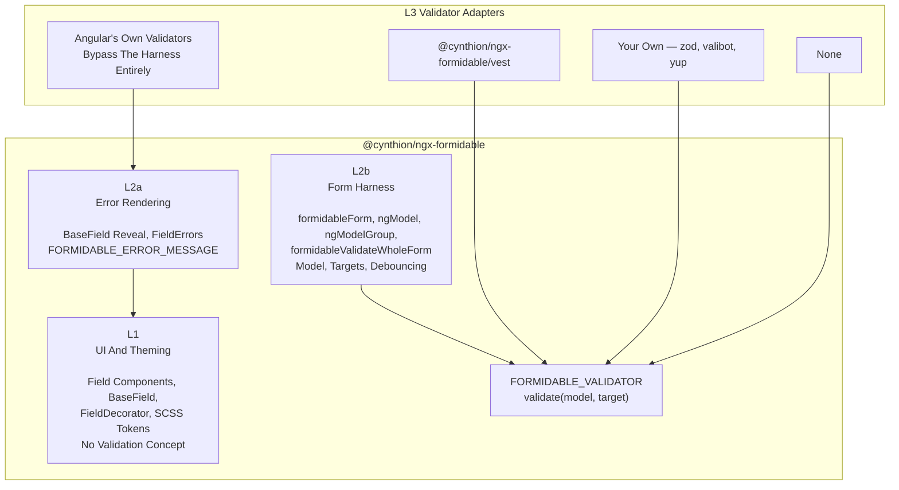

# Validation Architecture

Why the library carries no validation library, and where the seam sits.

## Three Layers


```mermaid
flowchart TB
  subgraph Core["@cynthion/ngx-formidable"]
    L1["L1<br/>UI And Theming<br/><br/>Field Components, BaseField,<br/>FieldDecorator, SCSS Tokens<br/>No Validation Concept"]
    L2a["L2a<br/>Error Rendering<br/><br/>BaseField Reveal, FieldErrors<br/>FORMIDABLE_ERROR_MESSAGE"]
    L2b["L2b<br/>Form Harness<br/><br/>formidableForm, ngModel, ngModelGroup,<br/>formidableValidateWholeForm<br/>Model, Targets, Debouncing"]
    Seam["FORMIDABLE_VALIDATOR<br/>validate(model, target)"]
  end
  subgraph Adapters["L3 Validator Adapters"]
    Vest["@cynthion/ngx-formidable/vest"]
    Own["Your Own — zod, valibot, yup"]
    Angular["Angular's Own Validators<br/>Bypass The Harness Entirely"]
    None["None"]
  end

  L2b --> Seam
  Vest --> Seam
  Own --> Seam
  Angular --> L2a
  None --> Seam
  L2a --> L1
```

| Layer | Owns                                                         | Knows About A Validator |
| :---- | :----------------------------------------------------------- | :---------------------: |
| L1    | Rendering, theming, masking, keyboard, ARIA                  |           No            |
| L2a   | Revealing the errors a forms API writes, as messages         |           No            |
| L2b   | The model, targets, debouncing, async validator registration |           No            |
| L3    | The validation rules                                         |           Yes           |

## The Two Universal Channels

Nothing in L1 or L2a is coupled to a validator because both rest on things Angular already guarantees:

- **The field's `errors` input** — every forms API writes a field's errors into it as `ValidationError`s: Signal Forms its rules' own, the classic APIs each key of `AbstractControl.errors` as `{ kind, context }`. The harness writes one error per message, keyed by it, so a message renders as its `kind`; `getAllFormErrors` reads the same keys, so `errorsChange` is one homogeneous `FormidableFormErrors` map however many validators wrote into it. `FORMIDABLE_ERROR_MESSAGE` turns each error into its text.
- **`.is-invalid`** — one class on `FieldDecorator`'s host, the field's `showErrors`: its errors weighed against its reveal. The whole SCSS state layer hangs off it, and it means nothing about who decided the field was invalid.

One naming trap worth knowing: `FormidableValidator.validate(model, target)` and Angular's `AsyncValidator.validate(control)` share a method name. No class in the library implements both — the three validator directives are `AsyncValidator`s, the Vest directive is an `FormidableValidator` — and TypeScript rejects it loudly if one ever tries.

## Why The Seam Is Where It Is

`createAsyncValidator` in `form.directive.ts` does five things. Four are generic:

1. Assemble the model. (See **The Model A Rule Sees** below.)
2. Patch the changed value in at the control's dotted target.
3. Debounce per the form's `debounceMs`, read afresh on every run.
4. **Run the rules.** ← the only validator-specific step
5. Map the result into `ValidationErrors`.

So the seam is a single method that takes `(model, target)` and returns messages. A validator is the smallest thing that can exist — the Vest one is about thirty lines, all of it the `suite.runStatic(model, target)` call and the `getErrors(target)` read off its result.

Putting the seam any lower would force each adapter to re-implement path computation and debouncing. Putting it any higher would drag the validator's own types into `form.directive.ts`.

## The Model A Rule Sees

The form's **live control values lead**, and `formValue` fills in only what has no control of its own. It cannot be the other way round: Angular calls `_runAsyncValidator` before it emits the `ValueChangeEvent` that `formValueChange` turns into the next `formValue`, so the bound model is one change behind at the moment a rule runs.

That is also why `formValue` is optional at every moment, including the first. A form whose model arrives through `| async`, or never binds one at all, validates against its control values alone.

`mergeValuesAndRawValues` supplies the live values, so a disabled control is included. `fillMissing` overlays `formValue` under them: it writes a key only where the target has none, so a cleared control's `null` stands rather than yielding to the value the model still holds.

Step 2 is what keeps the target itself current. A field's or a group's own validator runs during that control's own `updateValueAndValidity`, before the root recomputes its value, so its own target is the one place the live values lag.

## The Two Timing Axes

**Run** is when the validator runs, **reveal** is when the messages appear, and they are separate mechanisms with separate owners. Consumer-facing reference: [`user/validation.md`](../user/validation.md).

| Axis     | Owner   | Mechanism    | Read By                |
| :------- | :------ | :----------- | :--------------------- |
| Run      | Angular | `updateOn`   | `AbstractControl`      |
| Reveal   | Library | `revealOn`   | `BaseField.showErrors` |
| Debounce | Library | `debounceMs` | `createAsyncValidator` |

### Why Run Gets No Input

`updateOn` resolves by walking to the parent when a control sets nothing of its own, so `ngFormOptions` already cascades and `ngModelOptions` already overrides. A library input would restate that and could drift from it, and it could not see a per-field `ngModelOptions` a consumer set directly. So no library code sits in that path.

A library field is outside it: the classic APIs bind a field through its `value` model and commit every edit at once, whatever `updateOn` says. Only native controls in the same form still run on `blur` or `submit`.

### The Field Contract

Every field keeps to four rules, and the run axis relies on each:

- **Touch Last**: `touch` is the last act of a blur. `BaseField.onFocusChange` calls `doOnFocusChange` first, so a field that commits on blur, as `date-field` and `time-field` do, has written its value before the touch — which is what Signal Forms' `debounce(path, 'blur')` releases it on.
- **Only The User Writes The Model**: a field writes its `value` model only for a user's edit, through `setValue`, which writes nothing for an edit equal to the model. A programmatic write is an input write, so it reports nothing, touches nothing and dirties nothing, and the field corrects nothing it is given — no clamp, no re-mask, no reconcile against the options.
- **A Write Does Not Take The Caret**: a text field writes through `replaceText`, which leaves the element alone when it already shows that text and collapses the caret behind the text only when it replaced something. A consumer that echoes its model back writes the displayed value on every keystroke, and the caret and selection stay the user's.
- **A Field May Disown A Blur**: `ignoresBlur()` suppresses both the commit and the touch, for a field that moved focus onto something it owns. `date-field` does this so a control inside its panel stays clickable.

A touch is not cosmetic: it is what `revealOn="touched"` reads, so a touch nobody made would reveal a field nobody has visited. Dirty is not cosmetic either: it is what `revealOn="dirty"` reads.

### Reveal Resolution And Repaint

A field resolves its own `revealOn` first, then the form's, then `FORMIDABLE_DEFAULTS.revealOn`, then `touched`. Everything it weighs is a signal — its own inputs, which the forms API writes, and the form's `revealOn` — so `showErrors` is a `computed` and repaints on its own. See [`tech/decoration.md`](decoration.md) for what that one signal reaches, and why no classic API needs pumping.

### Debounce

`debounceMs` is read per run, inside a `timer` the validator returns. Angular cancels a control's pending async validator when the next run starts, so a newer change restarts the window; that cancellation is the debounce. There is no per-target cache to freeze the setting or to leak.

## Package Layout

```txt
projects/ngx-formidable/
├── src/                    → @cynthion/ngx-formidable      (L1, L2a, L2b)
│   └── lib/
│       ├── components/     L1 + L2a
│       ├── directives/     L1 — field-decoration attribute directives only
│       ├── forms/          L2b — the harness and its helpers
│       ├── helpers/        mask, input, format, position, option, utility
│       ├── models/         formidable.model.ts (UI) + validation.model.ts (the seam)
│       └── styles/
└── vest/                   → @cynthion/ngx-formidable/vest (L3)
```

`lib/forms/` holds the harness and its helpers; `directives/` holds the field-decoration attribute directives only. Everything under `forms/` is named `form*` and is reachable only from the harness.

`lib/forms/testing/stub-validator.directive.ts` is a test-only `FORMIDABLE_VALIDATOR` so the decorator specs can prove UI state travels from validity without pulling in a validation library. It is unreachable from `public-api.ts`, so ng-packagr never compiles it.

### `vest` As An Optional Peer

`vest` stays declared in the primary `package.json` — ng-packagr resolves every entry point's imports against it, and secondary entry points cannot declare their own dependencies. It is marked `peerDependenciesMeta.vest.optional`, which is what removes the forcing: npm neither installs nor warns about it.

What matters is that the type never reaches the main entry point. All of the main entry's `.d.ts` files are free of `vest`; exactly one file under `vest/` names it, and TypeScript only loads that file for a consumer who imports `@cynthion/ngx-formidable/vest`.

### Adding Another Adapter

A `/zod` entry point would be the same three files as `/vest`:

| File                                     | Content                                           |
| :--------------------------------------- | :------------------------------------------------ |
| `zod/ng-package.json`                    | `{ "lib": { "entryFile": "src/public-api.ts" } }` |
| `zod/src/public-api.ts`                  | one re-export                                     |
| `zod/src/lib/zod-validator.directive.ts` | the adapter, importing `@cynthion/ngx-formidable` |

Plus `zod` in `peerDependencies` marked optional, and a `tsconfig.json` path alias for the portal. Note that a secondary entry point must import the primary by its **package name**, not the dev alias — importing `ngx-formidable` puts the primary's sources under the secondary's `rootDir` and the build fails.

## Whole-Form Rules

`WHOLE_FORM` is the target a rule about the form itself reports under — the third of the three targets in [`user/validation.md`](../user/validation.md). It is the library's own convention, so it lives in `validation.model.ts` and `getAllFormErrors` keys the form's own messages by it.

`createAsyncValidator` deliberately skips its `set(model, target, value)` step for `WHOLE_FORM`: that target addresses the whole model rather than a path within it, so writing the form's value under a `wholeForm` key would hand the validator a key the model does not have. It needs no patching anyway — by the time the root form validates, its own value has been recomputed, so the live values in the assembled model are already current. See **The Model A Rule Sees**.

`NgxFormidableWholeFormValidate` delegates to `formDirective.createAsyncValidator(WHOLE_FORM)`.

It resolves the form directive in `ngOnInit` rather than injecting it. `NgForm` builds its `FormGroup` inside its own constructor, and a new `FormGroup` runs its async validators immediately, so `validate()` is first called while `NgForm` is still being constructed; asking for the form directive there would close the loop `NgForm` → `NG_ASYNC_VALIDATORS` → this directive → `NgForm` and throw NG0200.
