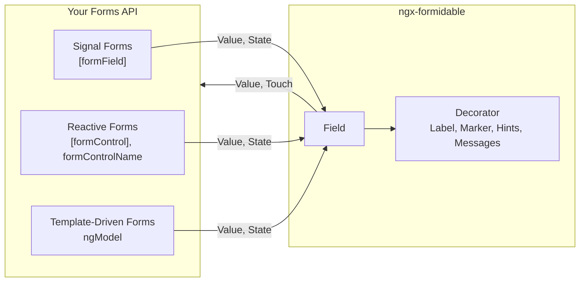
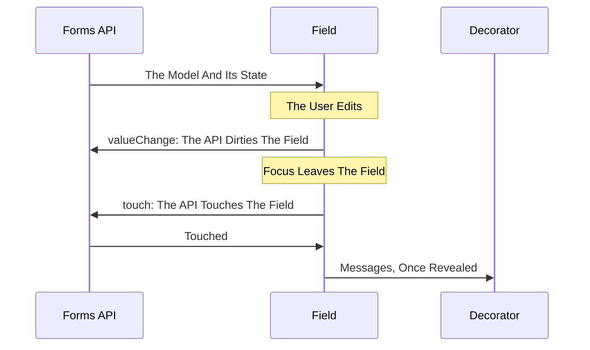

# ngx-formidable And Angular Forms

Every field binds to Signal Forms, reactive forms and template-driven forms alike. The forms API holds the model, its state and its rules; the library edits, renders, decorates and themes. This guide shows how the two meet under each API. Which validator writes the rules is in [Validation](validation.md).

## Who Owns What



| Concern                                                                  | Owner                               |
| :----------------------------------------------------------------------- | :---------------------------------- |
| The model, the rules, when they run, submission                          | Your forms API and your validator   |
| Touched, dirty, errors, pending, disabled, readonly, required            | Your forms API, handed to the field |
| Editing, keyboard, masking, panels, ARIA                                 | The field                           |
| Label, required marker, hints, prefix, suffix, messages and their reveal | The decorator, reading its field    |
| The text of a message                                                    | `FORMIDABLE_ERROR_MESSAGE`          |

The library has no form directive, no validator and no model of its own. What a form needs beyond the fields is the forms API's.

---

## How Value And State Flow



- **Only The User Writes The Model**: a field writes the model for a user's edit and never otherwise. A value your code writes is shown as it is and reported nowhere: it dirties nothing, touches nothing, and the field corrects nothing about it.
- **The Touch Comes Last**: `touch` is the last act of a blur. The date and time fields commit typed text on blur, and have written it by the time they touch.
- **A Move Inside A Field Is No Blur**: focus passing between a field's input and its panel neither commits nor touches, and a pick from a panel does not touch either.
- **State Repaints On Its Own**: every state a forms API hands a field is a signal input, so the field and its decorator follow a change with nothing to call.

---

## One Field, Three APIs

The same required email field, bound through each API.

### Signal Forms

The model, its initial value and its rules sit in one `*.form.ts`:

```ts
// user.form.ts
import { email, required, schema } from '@angular/forms/signals';

export interface UserModel {
  email: string;
}

export const initialUserModel: UserModel = { email: '' };

export const userSchema = schema<UserModel>((path) => {
  required(path.email, { message: 'An email address is required.' });
  email(path.email, { message: 'That does not look like an email address.' });
});
```

The component holds the model and the form over it:

```ts
// user-form.ts
import { Component, signal } from '@angular/core';
import { form, FormField, FormRoot } from '@angular/forms/signals';
import { FieldDecorator, FieldLabel, InputField } from '@cynthion/ngx-formidable';
import { initialUserModel, UserModel, userSchema } from './user.form';

@Component({
  selector: 'app-user-form',
  templateUrl: './user-form.html',
  imports: [FormRoot, FormField, FieldDecorator, FieldLabel, InputField]
})
export class UserForm {
  readonly model = signal<UserModel>(initialUserModel);
  readonly form = form(this.model, userSchema);
}
```

```html
<!-- user-form.html -->
<form [formRoot]="form">
  <formidable-field-decorator>
    <formidable-input-field [formField]="form.email" />
    <div formidableFieldLabel>Email Address</div>
  </formidable-field-decorator>
</form>
```

`required()` marks the field required as well as checking it, and each rule's `message` is the text the decorator renders.

### Reactive Forms

```ts
// user-form.ts
import { Component } from '@angular/core';
import { FormControl, FormGroup, ReactiveFormsModule, Validators } from '@angular/forms';
import { FieldDecorator, FieldLabel, InputField } from '@cynthion/ngx-formidable';

@Component({
  selector: 'app-user-form',
  templateUrl: './user-form.html',
  imports: [ReactiveFormsModule, FieldDecorator, FieldLabel, InputField]
})
export class UserForm {
  readonly form = new FormGroup({
    email: new FormControl('', { nonNullable: true, validators: [Validators.required, Validators.email] })
  });
}
```

```html
<!-- user-form.html -->
<form [formGroup]="form">
  <formidable-field-decorator>
    <formidable-input-field formControlName="email" />
    <div formidableFieldLabel>Email Address</div>
  </formidable-field-decorator>
</form>
```

`Validators.required` marks the field required. A classic error carries no text, so the messages read `required` and `email` until `FORMIDABLE_ERROR_MESSAGE` maps them, see [Validation](validation.md).

### Template-Driven Forms

```ts
// user-form.ts
import { Component, signal } from '@angular/core';
import { FormsModule } from '@angular/forms';
import { FieldDecorator, FieldLabel, InputField } from '@cynthion/ngx-formidable';

@Component({
  selector: 'app-user-form',
  templateUrl: './user-form.html',
  imports: [FormsModule, FieldDecorator, FieldLabel, InputField]
})
export class UserForm {
  readonly email = signal('');
}
```

```html
<!-- user-form.html -->
<form>
  <formidable-field-decorator>
    <formidable-input-field
      name="email"
      required
      [(ngModel)]="email" />
    <div formidableFieldLabel>Email Address</div>
  </formidable-field-decorator>
</form>
```

**A Template-Driven Form Validates No Library Field**: `ngModel` attaches no directive validator, such as `required`, `minlength` or `email`, to a custom control, so no rule written in the template reaches the field. The `required` attribute still marks it. To validate, bind the field through Signal Forms or reactive forms.

---

## Compatibility By Feature

| Feature                                        | Signal Forms                        | Reactive Forms                                               | Template-Driven Forms                                  |
| :--------------------------------------------- | :---------------------------------- | :----------------------------------------------------------- | :----------------------------------------------------- |
| Binds With                                     | `[formField]`                       | `[formControl]`, `formControlName`                           | `ngModel`                                              |
| The Model, Both Ways                           | Yes                                 | Yes                                                          | Yes                                                    |
| Touched, Dirty, Pending                        | Yes                                 | Yes                                                          | Yes                                                    |
| Disabled                                       | `disabled()`                        | `disable()` on the control                                   | `[disabled]` on the field                              |
| Readonly                                       | `readonly()`                        | `[readonly]` on the field                                    | `[readonly]` on the field                              |
| Required Marker                                | `required()`, or `REQUIRED`         | `Validators.required` on the control                         | The `required` attribute                               |
| Rules                                          | The `schema()`                      | The control's validators                                     | None reaches the field                                 |
| Message Text                                   | The rule's own `message`            | The error's `kind`, until `FORMIDABLE_ERROR_MESSAGE` maps it |                                                        |
| `name`, `min`, `max`, `minLength`, `maxLength` | From the schema                     | Bound on the field                                           | Bound on the field                                     |
| Value Held Back Until Blur                     | `debounce(path, 'blur')`            | Not possible: `updateOn` does not hold a field's value       | Not possible: `updateOn` does not hold a field's value |
| A Submit Reveals The Messages                  | Yes: `submit()` touches every field | After `markAllAsTouched()`                                   | After `markAllAsTouched()`                             |
| Conditional Fields                             | `hidden()`, then `@if`              | `disable()`, then `@if`                                      | `@if`                                                  |
| Text A Date Or Time Field Cannot Parse         | A `parse` error                     | A `parse` error                                              | A `parse` error                                        |

**Nothing Beside `[formField]`**: Signal Forms owns a field's `name`, `disabled`, `readonly`, `required` and limits, and the compiler rejects a binding to any of them beside `[formField]`. State each as a rule in the `schema()` instead.

---

## The Model

The model is the forms API's, and a field reads and writes one value in it.

| Field                                                                       | Value            |
| :-------------------------------------------------------------------------- | :--------------- |
| `input-field`, `textarea-field`                                             | `string`         |
| `toggle-field`                                                              | `boolean`        |
| `slider-field`                                                              | `number`         |
| `checkbox-group-field`                                                      | `string[]`       |
| `select-field`, `dropdown-field`, `autocomplete-field`, `radio-group-field` | `string \| null` |
| `date-field`, `time-field`                                                  | `Date \| null`   |

- **Signal Forms**: the model is a `signal` your component holds, and `form()` builds its field tree. Define every key in the initial model, at its value type's empty value: Signal Forms drops a key whose value is `undefined`, and binds a field only to a key its model defines. A group nests, so `form.payment.method` binds `model.payment.method`.
- **Reactive Forms**: the model is the `FormGroup`'s value, and each control starts its field at its own initial value. A control created without one holds `null`, which a field renders as its empty state. `form.value` leaves out a disabled control; `form.getRawValue()` keeps it.
- **Template-Driven Forms**: the model is yours, bound per field with `[(ngModel)]`. `NgForm` builds a value of its own from the controls it holds, keyed by `name` and nested by `ngModelGroup`.

**A Field Corrects Nothing It Is Given**: a value a field cannot render as it stands is rendered as near as the field can, and left as it is in the model. A slider shows a value outside `min` and `max` at the nearest end, a masked field shows a value through its mask, and an option field shows no selection for a value no option carries, until the option arrives.

---

## Conditional Fields

A field that belongs to the form only under a condition is Angular's `@if` in the template. What leaves the model and the rules with it differs per API.

### Signal Forms

`hidden()` in the schema states the condition, and the template renders the field only while it holds:

```ts
hidden(path.address, (context) => context.valueOf(path.pickup));
```

```html
@if (!form.address().hidden()) {
<formidable-field-decorator>
  <formidable-autocomplete-field [formField]="form.address" />
  <div formidableFieldLabel>Delivery Address</div>
</formidable-field-decorator>
}
```

A hidden field keeps its key and its value, and none of its rules runs: Signal Forms validates no field that is hidden, disabled or readonly.

### Reactive Forms

Disable the control while the condition holds, and render the field while it is enabled. A disabled control is left out of validation and out of `form.value`.

```ts
constructor() {
  this.form.controls.pickup.valueChanges.pipe(takeUntilDestroyed()).subscribe((pickup) => {
    if (pickup) this.form.controls.address.disable();
    else this.form.controls.address.enable();
  });
}
```

```html
@if (form.controls.address.enabled) {
<formidable-field-decorator>
  <formidable-autocomplete-field formControlName="address" />
  <div formidableFieldLabel>Delivery Address</div>
</formidable-field-decorator>
}
```

### Template-Driven Forms

`@if` destroys the field and its `NgModel` with it, so `NgForm`'s value loses the key. Your own model keeps its copy, and the field returns carrying it.

---

## Submission

### Signal Forms

Give `form()` a `submission`, and `[formRoot]` runs it on a native submit:

```ts
readonly form = form(this.model, userSchema, {
  submission: { action: async () => this.save(this.model()) }
});
```

```html
<form [formRoot]="form">
  <!-- fields -->
  <button type="submit">Save</button>
</form>
```

- **A Submit Touches Every Field**: `submit()` marks the whole form touched, so under the default `touched` reveal a submit reveals every message at once.
- **An Invalid Form Runs No Action**: it runs `onInvalid` instead, when one is given. A rule still pending does not hold the action back, unless `ignoreValidators` is `'none'`.
- **The Action May Answer With Errors**: errors it returns land on the fields they name, as a rule's would.

### Reactive Forms

```html
<form
  [formGroup]="form"
  (ngSubmit)="onSubmit()">
  <!-- fields -->
  <button type="submit">Save</button>
</form>
```

```ts
onSubmit(): void {
  this.form.markAllAsTouched();
  if (this.form.valid) this.save(this.form.getRawValue());
}
```

**`ngSubmit` Touches No Control**: `markAllAsTouched()` is what reveals the messages on a submit. While an async validator runs, the form is `pending` and not yet `valid`.

### Template-Driven Forms

`(ngSubmit)` on the `<form>` hands over your model as it stands. No rule reaches a library field under `ngModel`, so its validity says nothing about them. `ngSubmit` touches no control here either: call `markAllAsTouched()` on the `NgForm`'s `form` to reveal a date or time field's `parse` error.

---

## Related

- [Getting Started](getting-started.md): install, wiring, the stylesheet, a first form
- [Validation](validation.md): Angular's rules, Vest, Zod or none; messages and their reveal
- [Fields](fields.md): options, panels, keyboard, dates and times, masking, focus
- [Components](components.md): every public component, directive, token and type
