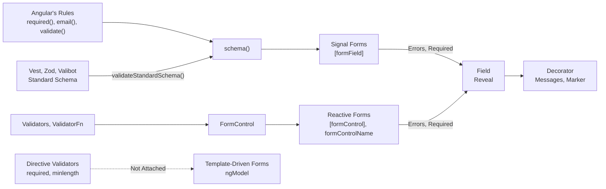

# Validation

The library validates nothing. A rule belongs to your forms API, and your validator writes it; the library renders what the rule reports: the message text, when it appears, where it appears, and the required marker. How a field meets each forms API is in [Forms](forms.md).

**Template-Driven Forms Validate No Library Field**: `ngModel` attaches no directive validator, such as `required`, `minlength` or `email`, to a custom control, so no rule written in a template reaches a library field. The `required` attribute still marks the field. To validate, bind the fields through Signal Forms or reactive forms.

## How Validation Works



- **A Rule Reaches The Field Through Its Forms API**: as the field's errors, and as its required state where the rule marks one.
- **The Field Decides When**: its messages appear once its reveal has come, `touched` by default, see [When A Rule Runs And When Its Messages Appear](#when-a-rule-runs-and-when-its-messages-appear).
- **The Decorator Renders Them**: below the field, each through `FORMIDABLE_ERROR_MESSAGE`, see [Messages](#messages).

---

## Choosing A Validator

| Validator                       | Where It Goes                                                                 | Marks Required        | Message Text                                                 | Install          |
| :------------------------------ | :---------------------------------------------------------------------------- | :-------------------- | :----------------------------------------------------------- | :--------------- |
| Angular's rules, the default    | The `schema()`                                                                | `required()`          | The rule's `message`                                         |                  |
| Vest                            | A suite created per form, run by `validateStandardSchema()` in the `schema()` | `REQUIRED` beside it  | The test's message                                           | `vest`           |
| Zod, Valibot, a Standard Schema | A schema beside the `schema()`, run by `validateStandardSchema()` in it       | `REQUIRED` beside it  | The issue's message                                          | `zod`, `valibot` |
| Classic validators              | The `FormControl`, under `[formControl]` or `formControlName`                 | `Validators.required` | The error's `kind`, until `FORMIDABLE_ERROR_MESSAGE` maps it |                  |
| None                            | Nowhere                                                                       | `REQUIRED`            |                                                              |                  |

The first three are Signal Forms and live in one `*.form.ts` per form, beside the model's type and its initial model:

```text
signup.form.ts
  SignupModel           the model's type
  initialSignupModel    the initial model, every key defined
  createSignupSuite()   Vest only: a factory, called once per form
  signupZodSchema       Zod only
  signupSchema          the schema(): each field's state, limits, conditions and rules
```

The Studio exports a form in exactly this layout, under any of the three. See [Studio](studio.md).

---

## Angular's Rules

The default, and the only validator that needs nothing installed. Every rule is a function in the `schema()`:

```ts
// signup.form.ts
import { email, minLength, required, schema, validate } from '@angular/forms/signals';

export interface SignupModel {
  email: string;
  password: string;
  confirmPassword: string;
  terms: boolean;
}

export const initialSignupModel: SignupModel = { email: '', password: '', confirmPassword: '', terms: false };

export const signupSchema = schema<SignupModel>((path) => {
  required(path.email, { message: 'An email address is required.' });
  email(path.email, { message: 'That does not look like an email address.' });
  required(path.password, { message: 'Choose a password.' });
  minLength(path.password, 12, { message: 'At least twelve characters.' });
  validate(path.confirmPassword, (context) => (context.value() === context.valueOf(path.password) ? undefined : { kind: 'mismatch', message: 'The passwords differ.' }));
  required(path.terms, { message: 'Accept the terms to continue.' });
});
```

- **`required()` Marks And Checks**: `[formField]` hands the field its required state from the same rule, so the marker and the check cannot disagree.
- **A Check Across Fields**: `validate()` reads any field through `context.valueOf()` and reports on the path it is given. On a field, the field's decorator renders it; on a group or on `path` itself it reports on the group or the whole form, which you place by hand. See [Messages](#messages).
- **A Check That Answers Later**: `validateAsync()` and `validateHttp()`. The field is `pending` meanwhile, and keeps its last messages on screen.

---

## Vest

A Vest suite is a Standard Schema, so `validateStandardSchema()` runs it in the `schema()`:

```ts
// signup.form.ts
import { metadata, REQUIRED, schema, validateStandardSchema } from '@angular/forms/signals';
import { create, enforce, mode, Modes, omitWhen, test } from 'vest';

// SignupModel and initialSignupModel as above.

/** A suite carries state across every run, so each form creates its own. */
export function createSignupSuite() {
  return create((model: SignupModel) => {
    mode(Modes.ALL); // every failing test, not only a field's first

    test('email', 'An email address is required.', () => {
      enforce(model.email).isNotEmpty();
    });

    omitWhen(!model.email, () => {
      test('email', 'That does not look like an email address.', () => {
        enforce(model.email).matches(/^[^@\s]+@[^@\s.]+\.[^@\s]+$/);
      });
    });

    test('confirmPassword', 'The passwords differ.', () => {
      enforce(model.confirmPassword === model.password).isTruthy();
    });
  });
}

export const signupSchema = schema<SignupModel>((path) => {
  metadata(path.email, REQUIRED, () => true);
  validateStandardSchema(path, createSignupSuite());
});
```

- **A Suite Per Form**: a suite made by `create` keeps state across every form it runs for, and grows slower with each. Call the factory inside `schema()`, which runs once per `form()`.
- **Every Failing Test**: without `mode(Modes.ALL)`, Vest reports only a field's first failing test, and skips an empty target once any test before it failed.
- **A Target Is A Path**: `'payment.method'` reports on that field and `'payment'` on its group. An empty target reports on the whole form; one running through a key the model lacks throws.
- **An Async Test Holds The Suite**: while an async Vest test runs, the form is `pending` and shows none of the suite's messages, its sync tests' included; they all arrive once it settles. A check that must not hold the others back belongs in `validateAsync()` or `validateHttp()` beside the suite.
- **Marking Required**: a Standard Schema cannot tell Signal Forms a field is required, so `metadata(path, REQUIRED, () => true)` marks it. `required()` would mark it as well, and report a second message for the same failure.

---

## Zod

A Zod schema is a Standard Schema too, and holds no state, so one serves every form:

```ts
// signup.form.ts
import { metadata, REQUIRED, schema, validateStandardSchema } from '@angular/forms/signals';
import * as z from 'zod';

// SignupModel and initialSignupModel as above.

export const signupZodSchema = z
  .object({
    email: z
      .string()
      .min(1, 'An email address is required.')
      .refine((value) => !value || /^[^@\s]+@[^@\s.]+\.[^@\s]+$/.test(value), 'That does not look like an email address.'),
    password: z.string().min(12, 'At least twelve characters.'),
    confirmPassword: z.string()
  })
  .refine((model) => model.confirmPassword === model.password, {
    error: 'The passwords differ.',
    path: ['confirmPassword']
  });

export const signupSchema = schema<SignupModel>((path) => {
  metadata(path.email, REQUIRED, () => true);
  validateStandardSchema(path, signupZodSchema);
});
```

- **Type Each Key As Its Field Writes It**: `z.string().nullable()` for an option field, `z.date().nullable()` for a date. A key holding a value of another type fails with a message of Zod's own and stops every refinement.
- **A Refinement Reports On The Path It Names**: a field, a group, or the whole form when it names no `path`.
- **The Schema Holds What It Checks**: its keys are the ones its rules read. The model may carry more.
- **Marking Required**: `REQUIRED` beside it, as for Vest.
- **Valibot And Every Other Standard Schema**: run through `validateStandardSchema()` the same way.

---

## Two Validators In One Form

More validators combine as more rules in one `schema()`. Here Zod checks the shape, and Angular's `validateHttp()` asks a server whether the address is taken:

```ts
export const signupSchema = schema<SignupModel>((path) => {
  metadata(path.email, REQUIRED, () => true);
  validateStandardSchema(path, signupZodSchema);
  validateHttp(path.email, {
    request: (context) => (context.value() ? `/api/email-taken?address=${encodeURIComponent(context.value())}` : undefined),
    onSuccess: (taken: boolean) => (taken ? { kind: 'taken', message: 'That address is taken.' } : undefined),
    onError: () => undefined
  });
});
```

- **One Owner Per Check**: give each check to one validator. A field checked for emptiness by both Zod and `required()` reports the same failure twice.
- **`validateHttp()` Needs `HttpClient`**: `provideHttpClient()` in the app config.

---

## Classic Validators

Under reactive forms, the rules are the control's validators:

```ts
readonly form = new FormGroup({
  name: new FormControl('', { nonNullable: true, validators: [Validators.required, Validators.minLength(3)] })
});
```

- **An Error Carries No Text**: a classic error reaches the field as `{ kind, context }` (`Validators.minLength(3)` as `{ kind: 'minlength', context: { requiredLength: 3, actualLength: 2 } }`), so its message is its `kind` until `FORMIDABLE_ERROR_MESSAGE` gives it one. See [Messages](#messages).
- **`Validators.required` Marks The Field**: the control holding `Validators.required` itself is what marks it. A validator wrapping it, or `Validators.requiredTrue`, does not.
- **A Standard Schema Needs A `ValidatorFn` Here**: `validateStandardSchema()` is Signal Forms'. Under reactive forms, a Zod or Vest schema runs inside a `ValidatorFn` of your own, and its message reaches the field only through the error's `context`.
- **`updateOn` Holds Nothing Back**: `blur` and `submit` do not delay a library field's value, and so do not delay its rules.

---

## Required By Value Type

The two `required`s disagree about what is empty:

| Field                                                                       | `required()` Fails On                                 | `Validators.required` Fails On             |
| :-------------------------------------------------------------------------- | :---------------------------------------------------- | :----------------------------------------- |
| `input-field`, `textarea-field`                                             | `''`                                                  | `''`                                       |
| `select-field`, `dropdown-field`, `autocomplete-field`, `radio-group-field` | `null`                                                | `null`                                     |
| `date-field`, `time-field`                                                  | `null`                                                | `null`                                     |
| `toggle-field`                                                              | `false`                                               | Never: `Validators.requiredTrue` checks it |
| `slider-field`                                                              | Never                                                 | Never                                      |
| `checkbox-group-field`                                                      | Never: `[]` is not empty, so add `minLength(path, 1)` | `[]`                                       |

---

## When A Rule Runs And When Its Messages Appear

**Run** is when a rule checks and **reveal** is when its messages appear. They have separate owners, and most forms want them apart: quiet while a field is first typed into, live while it is corrected.

| Axis   | Owner          | Set With                                                                                                     |
| :----- | :------------- | :----------------------------------------------------------------------------------------------------------- |
| Run    | Your forms API | Signal Forms: every change, or `debounce(path, 'blur')` to hold an edit until the touch. Classic: every edit |
| Reveal | The library    | `revealOn`                                                                                                   |

| `revealOn`          | Messages Appear Once                                |
| :------------------ | :-------------------------------------------------- |
| `touched` (default) | The user has left the field, or a submit touched it |
| `dirty`             | The user has edited the field                       |
| `always`            | The field is invalid                                |

```html
<!-- this one reveals as soon as it is edited -->
<formidable-input-field
  revealOn="dirty"
  [formField]="form.email" />
```

- **Where It Is Set**: on the field, then `revealOn` in the nearest `FORMIDABLE_DEFAULTS`, then `touched`. The app's defaults are in [Getting Started](getting-started.md); a component providing `FORMIDABLE_DEFAULTS` sets them for every field it renders.
- **Touched And Dirty Latch**: a field that becomes valid again has nothing left to say, and one that turns invalid again says it at once. `reset()` clears both, under every API.
- **A Submit Touches Only Under Signal Forms**: `submit()` touches every field, so it reveals every message under `touched`. A classic `ngSubmit` touches nothing, so call `markAllAsTouched()`. See [Forms](forms.md).
- **Pending Keeps The Last Messages**: while a rule runs, the field keeps what it last reported, so the messages do not blink away and back on every run.
- **Invalid With Nothing To Say**: a field the API holds invalid with no errors turns invalid once revealed, with no message.

---

## Messages

Each decorator renders its own field's messages, below the field, in an `aria-live="polite"` region. The text of every message is `FORMIDABLE_ERROR_MESSAGE`'s, which defaults to the error's `message`, else its `kind`. A rule of Signal Forms carries the `message` you wrote; a classic error carries none, so this is where it gets one:

```ts
// app.config.ts
import { ApplicationConfig } from '@angular/core';
import { ValidationError } from '@angular/forms/signals';
import { FORMIDABLE_ERROR_MESSAGE, FormidableErrorMessageFn, provideNgxFormidable } from '@cynthion/ngx-formidable';

const errorMessage: FormidableErrorMessageFn = (error) => {
  const context = (error as ValidationError & { context?: Record<string, unknown> }).context;

  switch (error.kind) {
    case 'required':
      return 'This field is required.';
    case 'minlength':
      return `At least ${context?.['requiredLength']} characters.`;
    default:
      return error.message ?? error.kind;
  }
};

export const appConfig: ApplicationConfig = {
  providers: [...provideNgxFormidable(), { provide: FORMIDABLE_ERROR_MESSAGE, useValue: errorMessage }]
};
```

Provide it with `useFactory` instead to read a translation service through `inject()`.

**A Group's Or The Form's Messages**: a rule on a group or on the whole form reports on no field, so no decorator renders it. Place a `formidable-field-errors` where the messages belong and hand it the errors, gated as you want them revealed:

```html
<formidable-field-errors [errors]="form.when().touched() ? form.when().errors() : []" /> <formidable-field-errors [errors]="form().errors()" />
```

A group is touched once any field in it is. `formidable-field-errors` renders what it is given and decides nothing about when.

---

## No Validation

Leave the rules out. The fields still edit, render, mask and theme, and a date or time field still reports text it cannot parse, as a `parse` error. Under Signal Forms, `REQUIRED` marks a field required with no check behind it; under `ngModel`, the `required` attribute does the same.

---

## Related

- [Forms](forms.md): how the fields meet Signal Forms, reactive forms and template-driven forms
- [Getting Started](getting-started.md): install, wiring, the stylesheet, a first form
- [Decoration](decoration.md): labels, adornments, prefixes, suffixes, hints, required marker
- [Components](components.md): every public component, directive, token and type
